# Estándar en la Calidad del uso: Normas ISO/IEC 9241

- **Fuente original:** 2. ISOIEC 9241.pdf
- **Total de páginas:** 40
- **Nota de conversión:** se conserva una imagen de cada página para no perder tablas, gráficos, diagramas ni contenido visual que pueda estar integrado como imagen.

---

## Página 1

Estándar en la Calidad del uso:
Normas ISO/IEC 9241
Ing. Diego Gamboa Mgtr.
SQA

---

## Página 2

• Introducción a la norma ISO/IEC 9241
• Principios de diseño ergonómico en la norma ISO 9241-
112:2025
• Recomendaciones para sistemas interactivos
• Contextos de aplicación de la norma ISO 9241-112
Contenidos

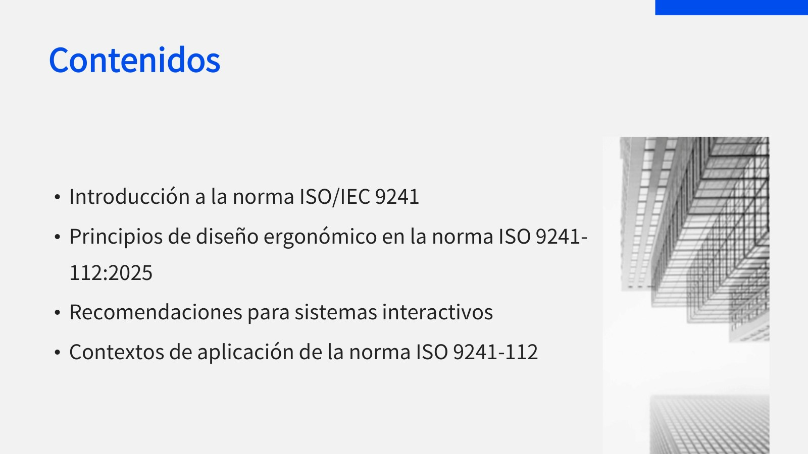

---

## Página 3

• Ejemplos de uso en la vida real
• Ejercicio práctico
• Taller en clase
• Desafíos de la implementación de la norma ISO 9241
• Orientaciones futuras de la norma ISO/IEC 9241
Contenidos

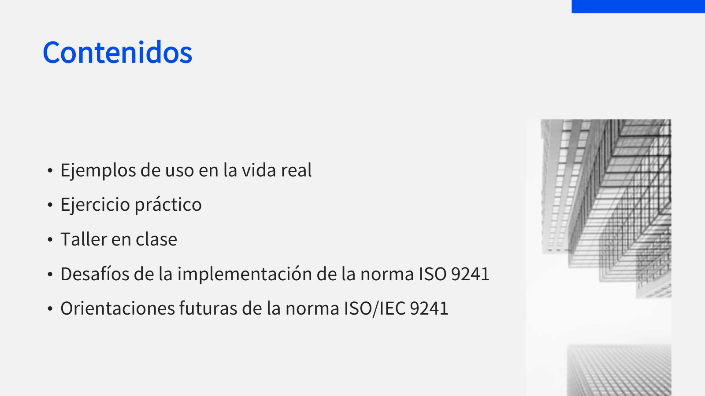

---

## Página 4

Introducción a la
norma ISO/IEC 9241
01

---

## Página 5

Definición y objetivos
Definición
La norma ISO/IEC 9241 es un
estándar internacional que se
centra en los requisitos de
usabilidad y ergonomía en la
interacción entre los humanos y
los sistemas tecnológicos.
Propósito
Establecer criterios que ayuden
a diseñar sistemas interactivos
eficientes, efectivos y
satisfactorios para los usuarios.
Enfoque usuario
Prioriza las necesidades,
capacidades y limitaciones del
usuario final para garantizar
una interacción óptima y
reducir errores humanos.

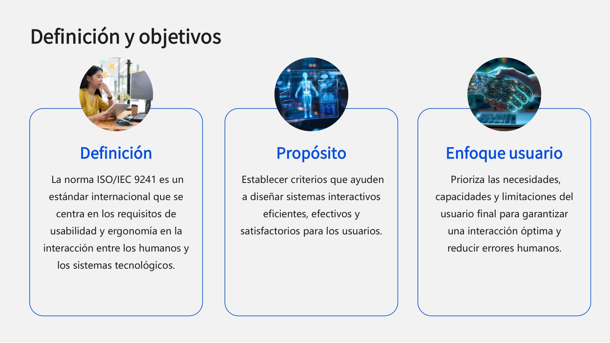

---

## Página 6

Utilizado en el diseño de estaciones de trabajo, herramientas y aplicaciones para
garantizar la comodidad y productividad del usuario.
Áreas clave de aplicación
Entornos laborales
Guía la creación de interfaces de usuario fáciles de usar, mejorando la
experiencia general del usuario final.
Software y aplicaciones
Aplica principios de diseño ergonómico a dispositivos como teléfonos móviles,
cajeros automáticos y sistemas operativos.
Productos electrónicos

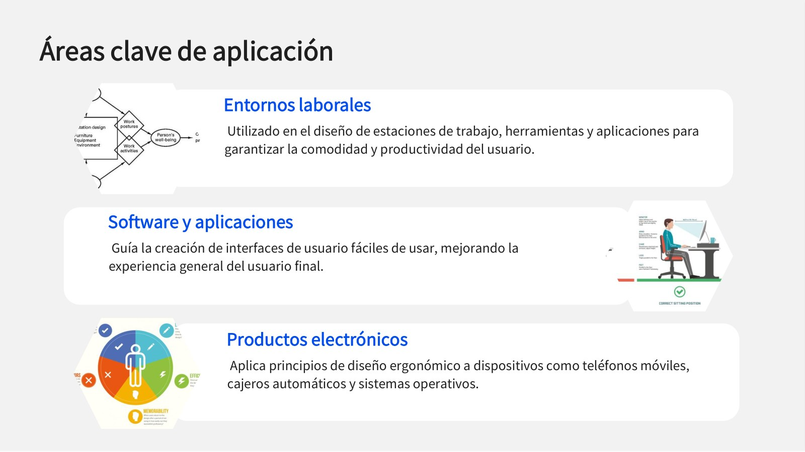

---

## Página 7

Importancia para los sistemas interactivos
01
Mejora la facilidad de uso y navegación en productos y sistemas, haciendo que sean más accesibles
para diferentes tipos de usuarios.
Usabilidad mejorada
02
Minimiza los riesgos de errores del usuario a través del diseño intuitivo y el enfoque centrado en la
experiencia humana.
Reducción de errores
03
Fomenta una relación positiva entre los usuarios y los sistemas al enfocarse en la comodidad y la
efectividad del uso.
Experiencia satisfactoria

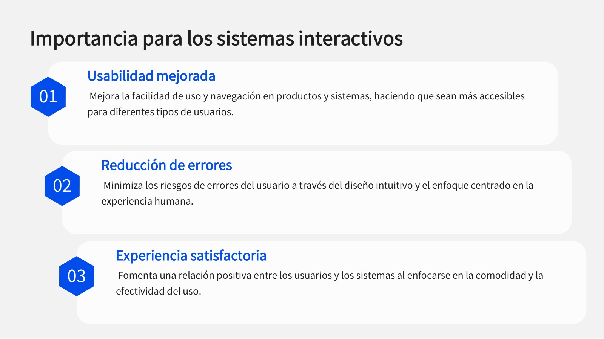

---

## Página 8

Principios de diseño
ergonómico en la
norma ISO 9241-
112:2025
02

---

## Página 9

Principios de la interacción visual
Consistencia visual
El uso de formatos, colores y diseños uniformes facilita la navegación y la comprensión de la información para los
usuarios.
Claridad gráfica
Diseños que priorizan la legibilidad, incluyendo contraste adecuado, tamaño de fuente suficiente y espaciado, optimizan
la percepción visual.
Enfoque en tareas
La disposición de elementos debe destacar las funciones más relevantes, minimizando distracciones innecesarias.
Adaptabilidad
Interfaces visuales que permiten ajustes personalizados (como tamaño de texto o colores) mejoran la accesibilidad para
personas con necesidades específicas.

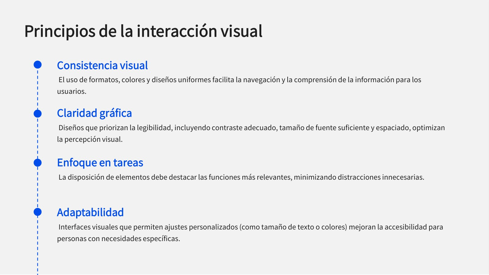

---

## Página 10

Los sonidos deben ser claros y reconocibles,
diferenciando alarmas, notificaciones e
indicaciones funcionales.
Identificación sonora
Los tonos y sonidos deben tener duraciones
que respeten la capacidad de procesamiento
auditivo de los usuarios.
Tiempo adecuado
Diseños auditivos deben limitar el uso de
múltiples sonidos simultáneos para evitar
confusiones o molestias.
Evitación de saturación
01
03
02
Principios de la interacción auditiva
Sistemas que incluyen subtítulos o
alternativas visuales garantizan la inclusión
de personas con discapacidad auditiva.
Accesibilidad auditiva
04

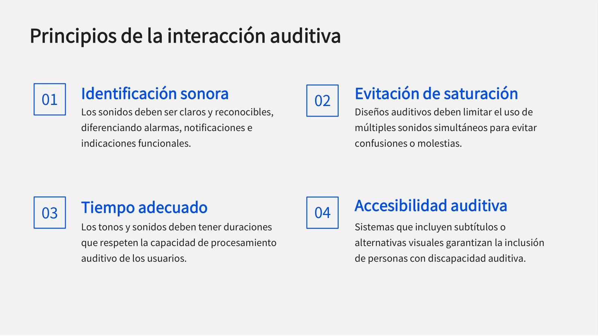

---

## Página 11

Principios de la interacción táctil o háptica
La retroalimentación táctil
debe ser clara y
diferenciada, asegurando
que los usuarios puedan
identificar acciones
específicas.
Los sistemas hápticos
deben permitir el ajuste
de la fuerza o intensidad
según las preferencias y
necesidades individuales.
Los mecanismos hápticos
deben proporcionar
respuestas inmediatas
para mejorar la
percepción y la confianza
en la interacción.
El diseño táctil debe
considerar tamaños,
formas y disposición
ergonómica que se
adapten a diversas
características físicas de
los usuarios.
Sensaciones precisas
Intensidad ajustable
Temporalidad
efectiva
Compatibilidad física
La iteracción táctil capta el contacto superficial, mientras que la háptica integra esa información con la cinestesia
(fuerza, posición) para crear una percepción completa de interacción física. En esencia, el tacto es la entrada
sensorial y la háptica su interpretación activa.

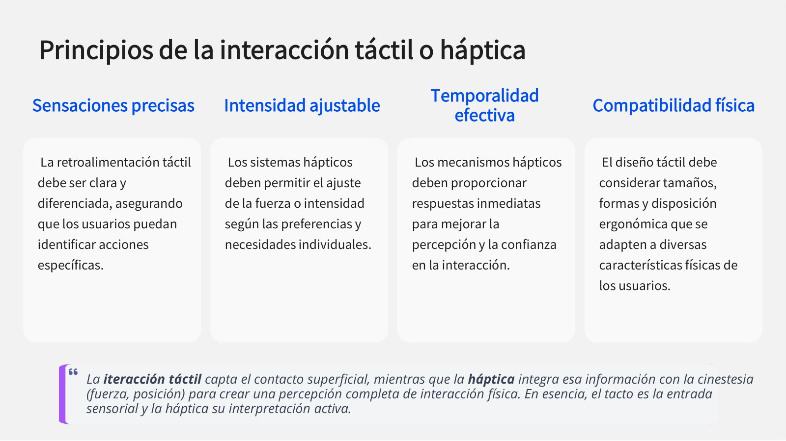

---

## Página 12

Recomendaciones
para sistemas
interactivos
03

---

## Página 13

Recomendaciones de accesibilidad
Diseñar para usuarios con
discapacidades físicas,
sensoriales o cognitivas,
garantizando acceso
equitativo a
funcionalidades clave.
Inclusión
Implementar múltiples
modalidades de entrada
(voz, teclado, ratón) y
ajustes personalizables
para necesidades
específicas.
Opciones
alternativas
Asegurar una adecuada
relación entre texto y
fondo para facilitar la
legibilidad, especialmente
para usuarios con baja
visión.
Contrastes
visuales
Utilizar estándares
tecnológicos universales
que permitan integrarse
fácilmente con
dispositivos auxiliares,
como lectores de pantalla.
Compatibilidad

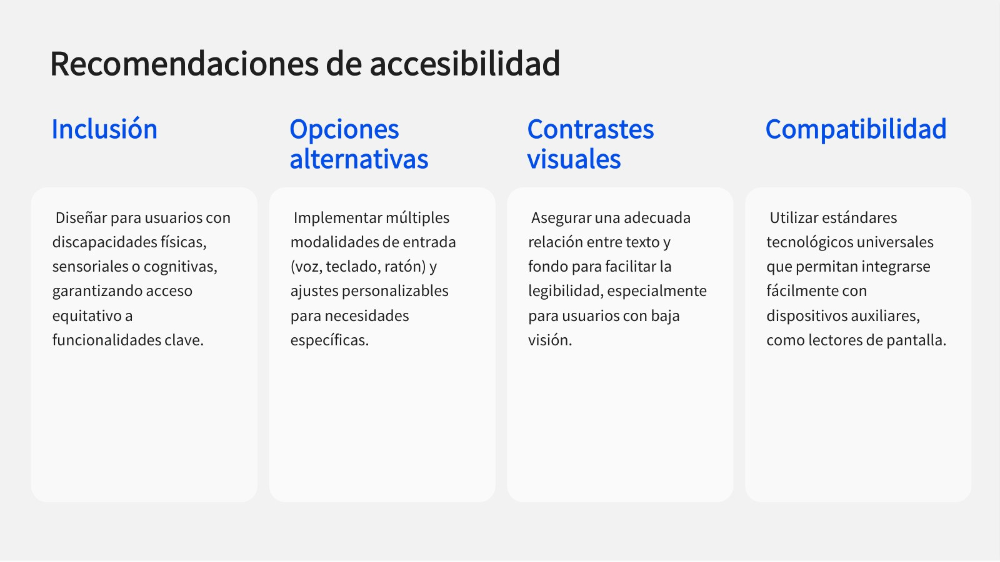

---

## Página 14

Recomendaciones para la interacción multimodal
Coordinar efectivamente
entre estímulos visuales,
auditivos y táctiles para
una experiencia fluida y
coherente.
Proporcionar múltiples
formatos de información
(texto, audio, vibración)
para asegurar la
comprensión por
diferentes tipos de
usuarios.
Permitir que los usuarios
elijan su modalidad
preferida según su
comodidad y capacidades.
Garantizar que las
interacciones
multimodales
proporcionen
retroalimentación rápida y
clara, minimizando
incertidumbre.
Sincronización entre
modalidades
Redundancia
Preferencias
personalizables
Respuesta inmediata

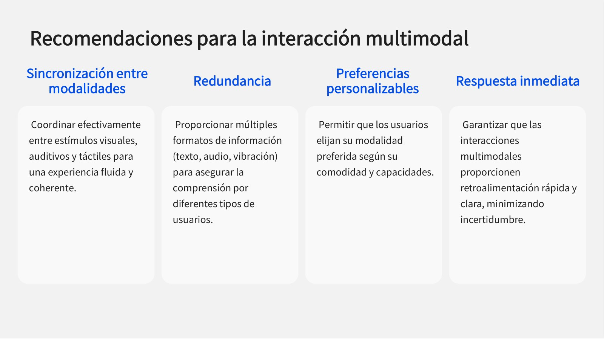

---

## Página 15

Recomendaciones para la presentación de contenidos
Diseñar interfaces con
jerarquías claras, utilizando
tamaños de fuente y espacios
adecuados para facilitar la
lectura.
Claridad visual
Presentar información en un
orden comprensible que
respete principios mentales
como agrupación y
secuenciación.
Organización lógica
Evitar saturar al usuario con
contenido irrelevante,
priorizando datos esenciales
para reducir la sobrecarga
cognitiva.
Concisión
Mantener coherencia en
diseño y terminología dentro
de todas las pantallas,
creando un entorno familiar y
fácil de navegar.
Consistencia

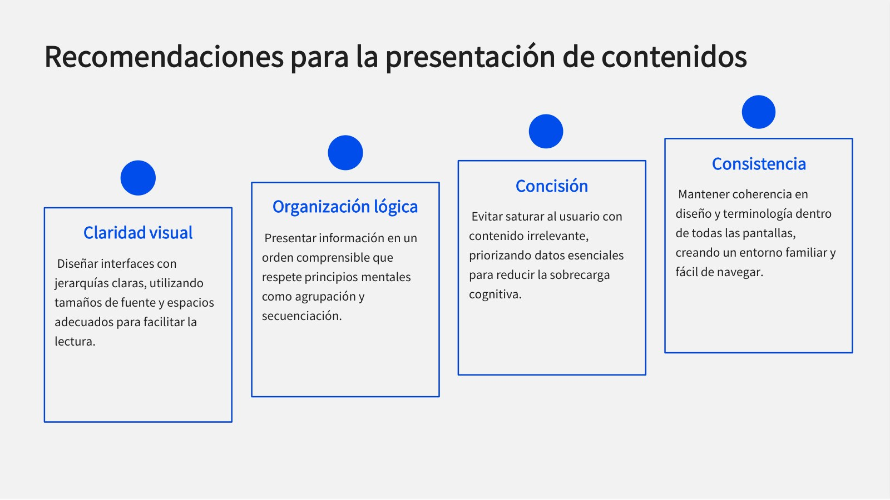

---

## Página 16

Contextos de
aplicación de la
norma ISO 9241-112
04

---

## Página 17

El estándar proporciona principios para mejorar la interacción entre los usuarios y los
sistemas informáticos a través de modalidades visuales, auditivas y hápticas.
Sistemas TIC
Interactividad
Promueve una presentación clara y efectiva que facilite la percepción y el
entendimiento de la información generada por las tecnologías de información y
comunicación.
Comprensión
Ayuda a estructurar interfaces accesibles para usuarios con diversas capacidades y
necesidades, fomentando la usabilidad universal.
Diseño inclusivo

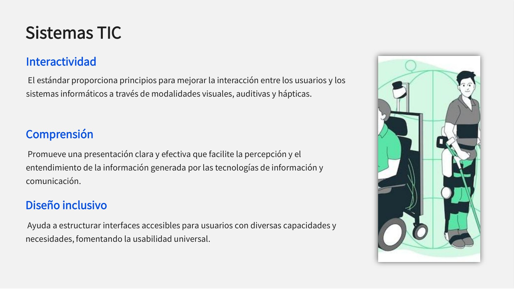

---

## Página 18

Documentos impresos y digitales
Compatibilidad
Calidad visual
Estandarización
Aplica reglas para garantizar que los documentos exportados
(PDF, texto, tablas, etc.) sean claros y legibles independientemente
del medio utilizado.
Establece principios que aseguran la coherencia en la
presentación de información entre versiones impresas y digitales
de los documentos generados.
Recomendaciones para mejorar la disposición de elementos
visuales en documentos, evitando la pérdida de información o
ambigüedades que dificulten la interpretación.

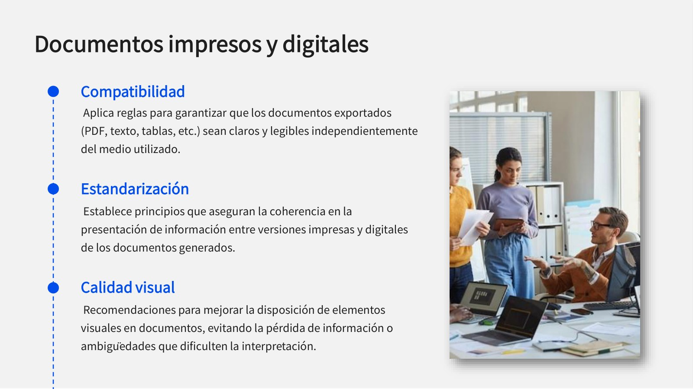

---

## Página 19

Aplicaciones médicas
Se utiliza para diseñar interfaces de software en equipos médicos
que garantizan una presentación precisa y clara de información
crítica.
Educación digital
Contribuye a crear plataformas de aprendizaje en línea efectivas
y accesibles para estudiantes con diferentes estilos de
aprendizaje y discapacidades.
Transporte
Facilita la creación de sistemas de señalización y software en
vehículos que optimizan la experiencia del usuario y mejoran la
seguridad.
Dominios especializados

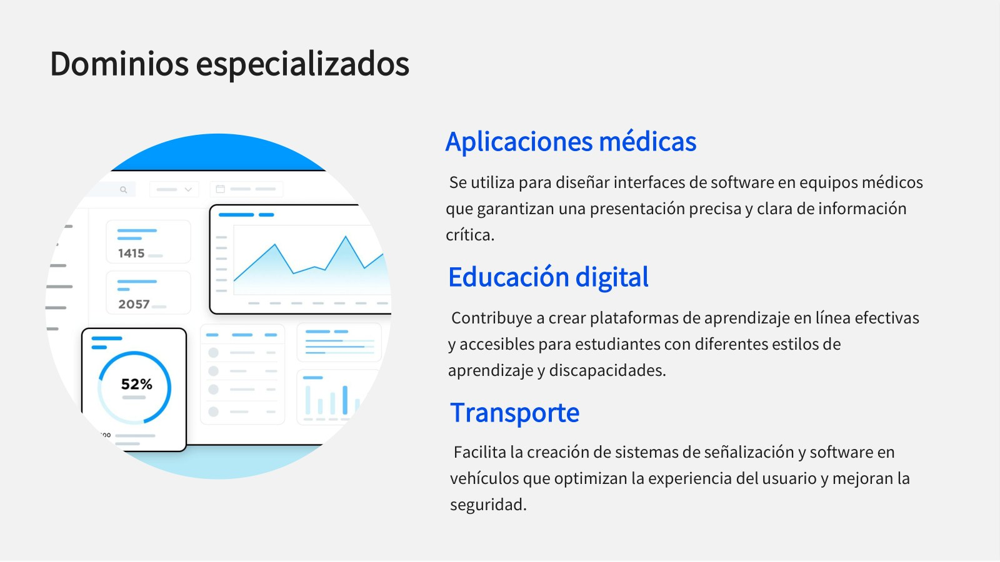

---

## Página 20

Ejemplos de uso en la
vida real
05

---

## Página 21

Intuitividad
Incorporar configuraciones personalizables
permite que los usuarios ajusten el sistema
a sus necesidades específicas.
Adaptabilidad
Consistencia
Establecer un diseño uniforme en los
elementos funcionales evita confusiones y
facilita la interacción.
Implementar interfaces con navegación
simplificada mejora la experiencia del
usuario al disminuir la curva de
aprendizaje.
Ejemplo 1: Diseño de software con usabilidad mejorada

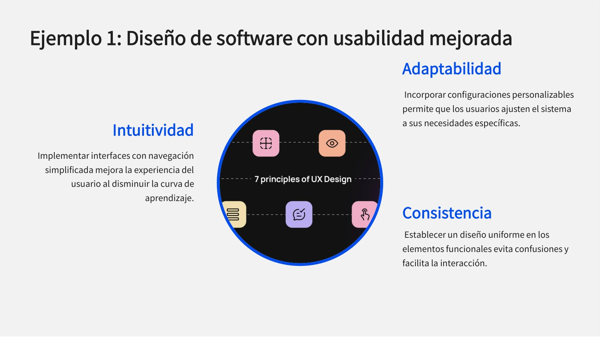

---

## Página 22

Ejemplo 2: Plataformas web accesibles
Inclusión
Adaptar los sitios web para personas con discapacidades visuales mediante
lectores de pantalla permite un acceso universal.
Compatibilidad
Diseñar plataformas que funcionen correctamente en dispositivos y
navegadores diversos asegura la accesibilidad para todos.
Contenido estructurado
Utilizar encabezados y etiquetas claras facilita la navegación y comprensión del
sitio web para usuarios con discapacidad cognitive.

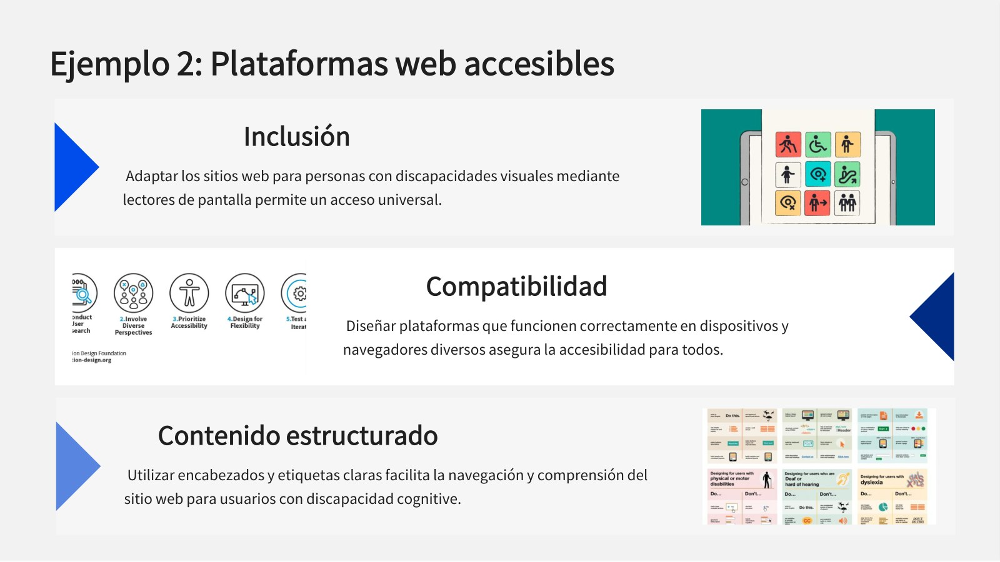

---

## Página 23

Comodidad
Diseñar dispositivos que se ajusten a la forma natural
de la mano reduce la fatiga y previene lesiones a largo
plazo.
Accesibilidad física
Incorporar teclas o botones grandes beneficia a
personas con movilidad limitada en las manos o los
dedos.
Interacción táctil
Utilizar materiales agradables al tacto en interfaces
físicas mejora la experiencia ergonómica del usuario.
Ejemplo 3: Diseño ergonómico de hardware

---

## Página 24

Ejercicio práctico
06

---

## Página 25

03
Seleccione un sistema del mundo real
02
Análisis comparativo
Evalúe el cumplimiento del sistema con los principios
ergonómicos de presentación de información
establecidos por la norma ISO 9241-112.
Métodos de análisis
Utilice técnicas como pruebas de usabilidad o revisión de
diseño para identificar fortalezas y debilidades del sistema
en cuestión.
01
Identificación del sistema
Escoja un sistema interactivo cotidiano como una
aplicación móvil, una página web o un dispositivo de
navegación.

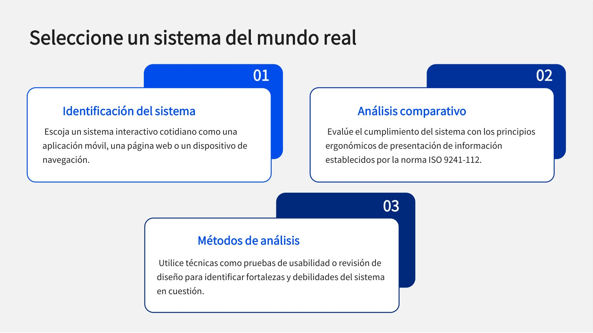

---

## Página 26

Identificar problemas de interacción del usuario
Problemas de percepción
Detecte dificultades en la interpretación visual, auditiva o táctil del contenido
presentado en el sistema.
Confusión en la navegación
Inclusión limitada
Identifique características que puedan generar obstáculos para el usuario, como
interfaces desorganizadas o comandos poco intuitivos.
Evalúe si el sistema no cumple con principios de accesibilidad y diversidad,
dejando fuera a ciertos grupos de usuarios.
1
2
3

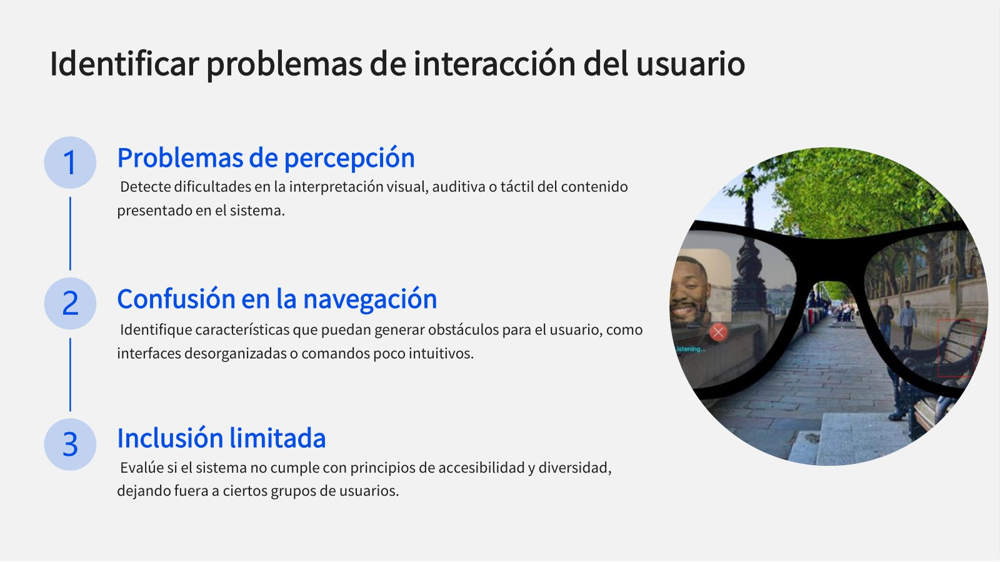

---

## Página 27

Recomendaciones de rediseño
Elementos visuales
Accesibilidad inclusiva
Feedback interactivo
Proponer cambios como mejorar el contraste, simplificar los gráficos o ajustar el tamaño de las fuentes para
mejorar la claridad visual.
Incorporar retroalimentación relevante (auditiva, visual o táctil) para confirmar acciones del usuario y mejorar
la experiencia.
Aplicar principios de diseño universal para garantizar que los sistemas sean comprensibles y utilizables por una
audiencia diversa, incluyendo personas con discapacidad.

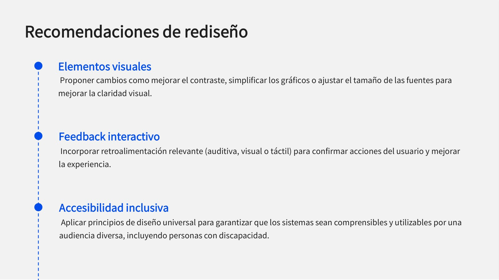

---

## Página 28

Taller en clase para
estudiantes
07

---

## Página 29

Selección de casos prácticos
Presentar escenarios relacionados con sistemas interactivos reales, como aplicaciones
móviles, sitios web o sistemas de gestión empresarial, para fomentar la conexión con el
mundo profesional.
Casos reales
Incluir casos que representen diferentes ámbitos (salud, educación, comercio),
promoviendo una visión amplia de la aplicación de los principios ergonómicos.
Diversidad
Proporcionar información detallada sobre el contexto del sistema para ayudar a los
estudiantes a comprender las posibles limitaciones y oportunidades.
Contexto

---

## Página 30

Analizar elementos específicos del
sistema, como el diseño visual, la
navegación, la accesibilidad, y su
impacto en la experiencia del
usuario.
Detección
inicial
Identificación del problema
Identificar brechas en los principios
clave establecidos por la norma ISO
9241-112 (modos visuales, auditivos
y táctiles).
Principios
aplicados
Fomentar una reflexión sobre cómo
los problemas detectados afectan
tanto la comprensión de la
información como la interacción del
usuario.
Evaluación
crítica

---

## Página 31

Desarrollo de soluciones grupales
Propuesta colaborativa
Justificación técnica
Alineación con el estándar
Formar equipos para que trabajen en soluciones de rediseño a los
problemas identificados, fomentando el trabajo en equipo y
prácticas colaborativas.
Asegurarse de que las propuestas se alineen con los principios y
recomendaciones de la norma ISO 9241-112, garantizando su
relevancia y aplicabilidad.
Explicar cómo sus soluciones abordan los problemas detectados,
destacando la mejora en la presentación y percepción de la
información.

---

## Página 32

Desafíos de la
implementación de la
norma ISO 9241
08

---

## Página 33

Interacción simultánea
La integración de múltiples modalidades (visual, táctil, auditiva) requiere coordinación precisa para evitar
interferencias entre los sistemas.
Evaluación de la usabilidad
Diseñar pruebas que midan la efectividad de las interacciones multimodales puede ser difícil por la falta de métricas
estandarizadas.
Compatibilidad tecnológica
La interoperabilidad entre dispositivos y plataformas es esencial, pero puede ser complicada debido a estándares y
lenguajes diversos.
Complejidad en sistemas multimodales

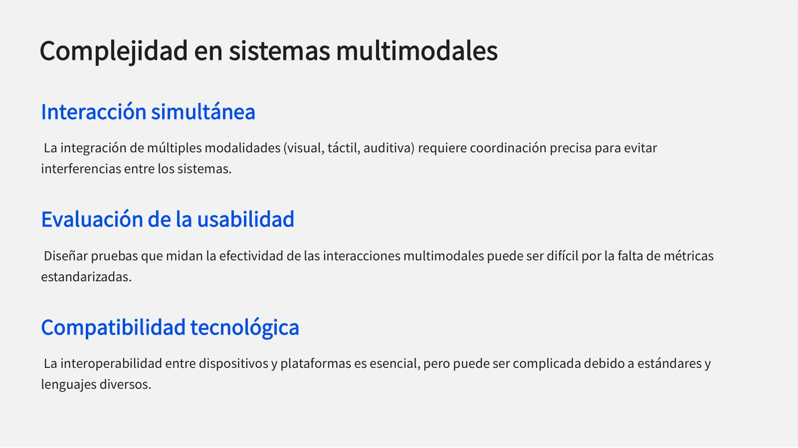

---

## Página 34

Limitaciones de costos y recursos
Inversión inicial
Implementar las recomendaciones requiere inversión en
equipamiento y formación especializada, lo cual puede ser
prohibitivo para pequeñas empresas.
Escasez de expertos
La falta de profesionales capacitados en ergonomía y usabilidad
puede limitar la aplicación efectiva de la norma en proyectos
concretos.
Costos de adaptación
Ajustar sistemas existentes para cumplir con la norma puede
demandar recursos significativos, desde rediseño de interfaces
hasta pruebas de usuario prolongadas.

---

## Página 35

Adaptaciones específicas de la industria
01
02
03
Demandas particulares
Cada industria tiene requisitos de usuario únicos (e.g.,
sistemas médicos versus entretenimiento), lo que complica la
implementación generalizada de la norma.
Flexibilidad normativa
La necesidad de adaptar las directrices a casos específicos
puede generar interpretaciones subjetivas y un cumplimiento
desigual.
Innovación vs. regulación
La rápida evolución tecnológica en sectores como el software
o la inteligencia artificial puede desafiar la capacidad de la
norma para mantenerse relevante.

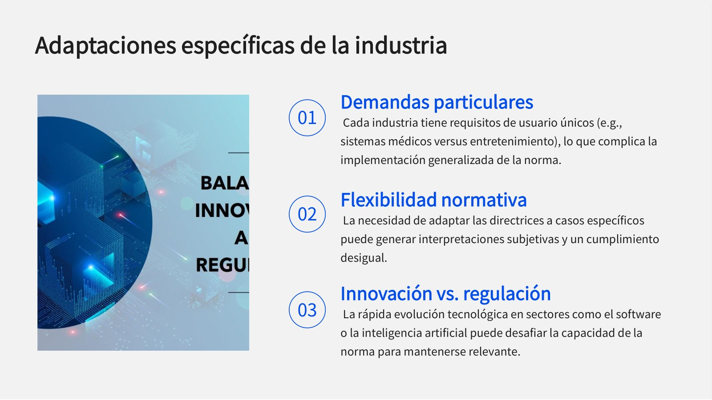

---

## Página 36

Orientaciones futuras
de la norma ISO/IEC
9241
09

---

## Página 37

Tecnologías emergentes
Interacción inmersiva
La integración de tecnologías como realidad virtual (VR) y realidad aumentada (AR) plantea
nuevas exigencias para garantizar la usabilidad y la ergonomía en entornos inmersivos.
03
02
01
Inteligencia artificial
La incorporación de sistemas basados en IA requiere estándares que regulen la interacción
intuitiva, confiable y ética entre humanos y máquinas inteligentes.
Interfaces biométricas
El diseño y evaluación de dispositivos que leen señales biométricas (como reconocimiento
facial o de voz) demandarán especificaciones más detalladas de la norma.

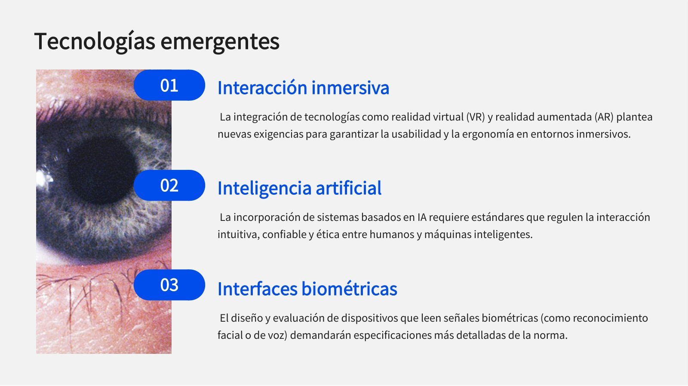

---

## Página 38

A medida que los usuarios buscan experiencias más adaptadas, la norma debe
abarcar pautas para aplicaciones y sistemas que se ajusten individualmente a las
preferencias y capacidades humanas.
Necesidades de los usuarios en expansión
Personalización avanzada
Las dinámicas del trabajo remoto y híbrido exigen consideraciones ergonómicas
para equipos que favorezcan la salud y productividad en casa o espacios de
coworking.
Entornos laborales cambiantes
El diseño para usuarios que operan en condiciones adversas (como temperaturas
extremas o baja visibilidad) se volverá una prioridad dentro de las normas.
Usabilidad en contextos extremos

---

## Página 39

Inclusión digital
La norma deberá atender a grupos vulnerables, como personas con discapacidades sensoriales,
físicas o cognitivas, mediante directrices específicas para interfaces accesibles.
Objetivos de accesibilidad más amplios
Idiomas y culturas múltiples
Establecer pautas para sistemas que respeten la diversidad cultural y lingüística garantizará la
usabilidad global de las interfaces.
Dispositivos para todos
La accesibilidad económica, junto con la adaptabilidad ergonómica, favorecerá el diseño universal
de tecnologías accesibles para usuarios de diversas condiciones socioeconómicas.

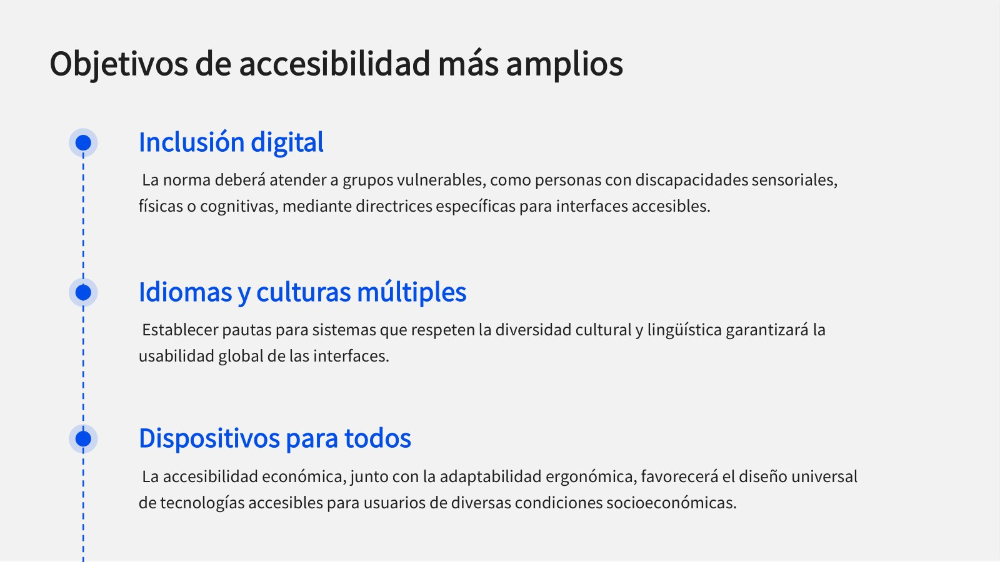

---

## Página 40

Gracias

