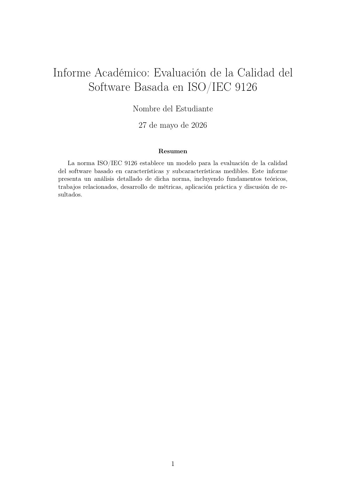
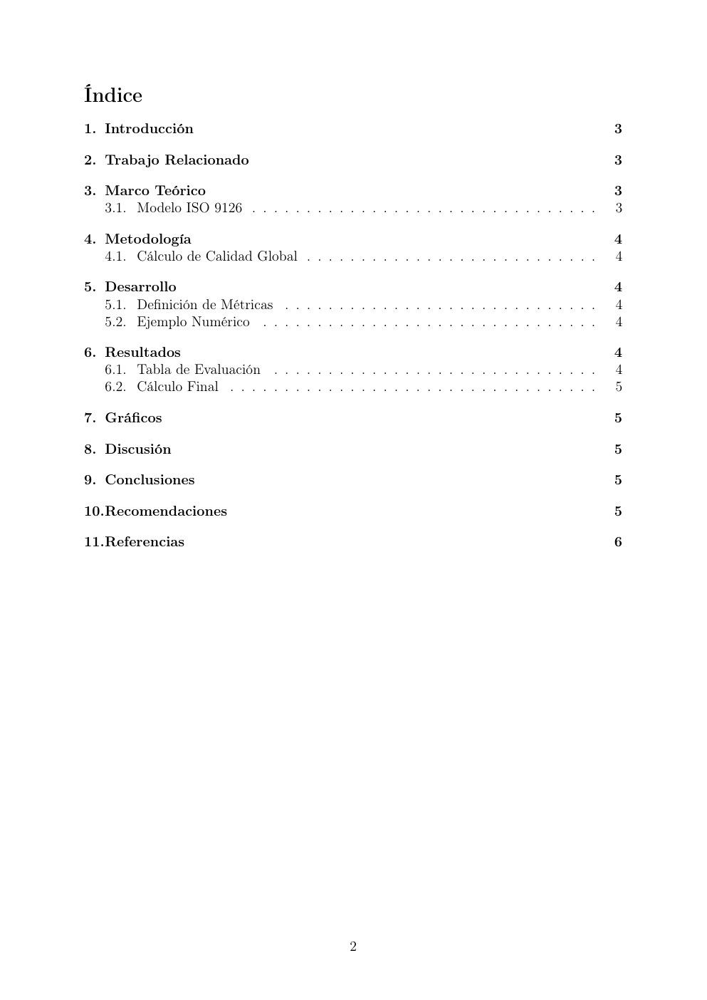
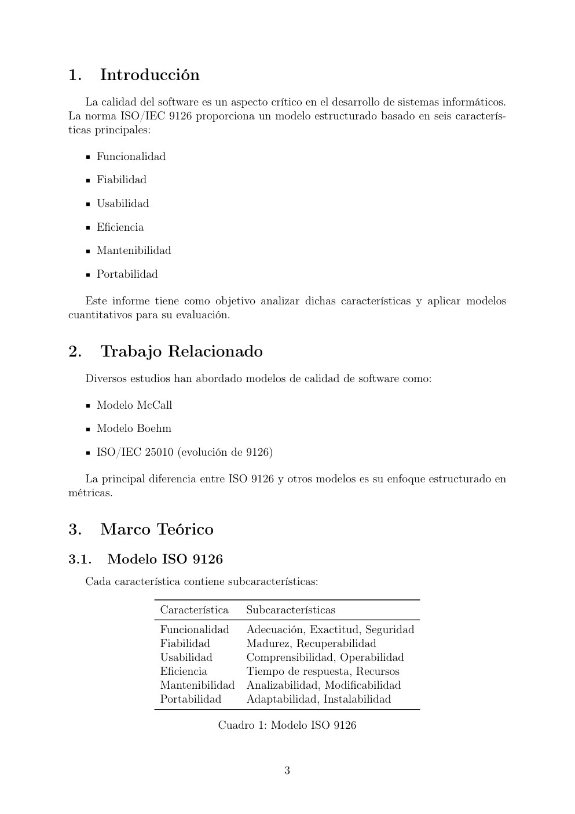
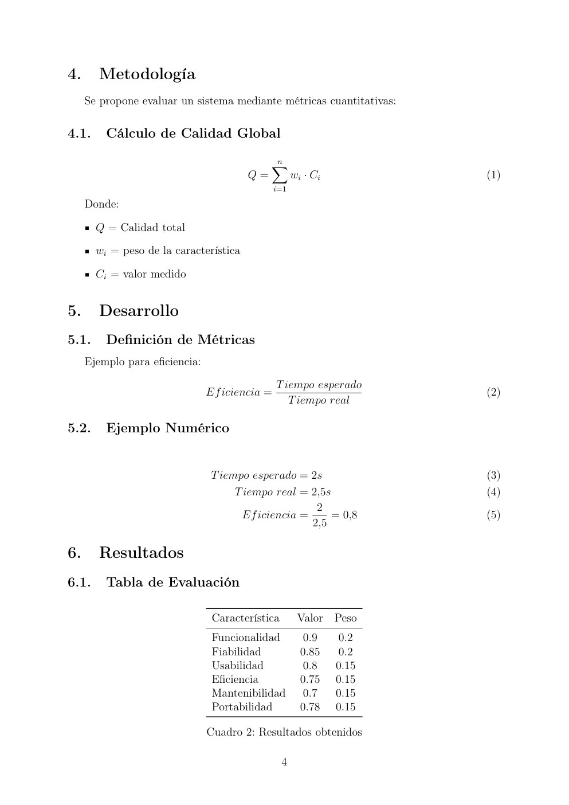
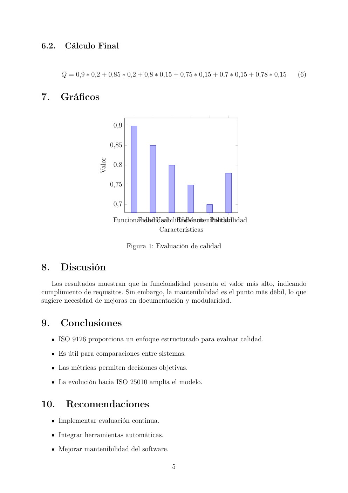
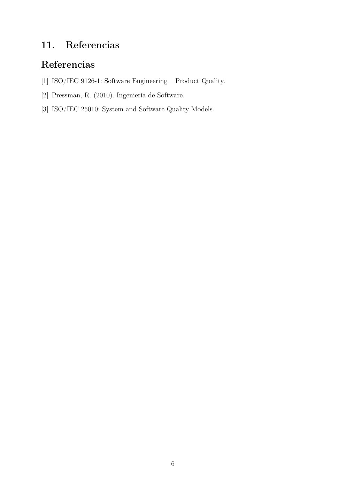

# Informe Académico: Evaluación de la Calidad del Software Basada en ISO/IEC 9126

- **Fuente original:** ActividadISO9126.pdf
- **Total de páginas:** 6
- **Nota de conversión:** se conserva una imagen de cada página para no perder tablas, gráficos, diagramas ni contenido visual que pueda estar integrado como imagen.

---

## Página 1

Informe Académico: Evaluación de la Calidad del
Software Basada en ISO/IEC 9126
Nombre del Estudiante
27 de mayo de 2026
Resumen
La norma ISO/IEC 9126 establece un modelo para la evaluación de la calidad
del software basado en características y subcaracterísticas medibles. Este informe
presenta un análisis detallado de dicha norma, incluyendo fundamentos teóricos,
trabajos relacionados, desarrollo de métricas, aplicación práctica y discusión de re-
sultados.
1

---

## Página 2

Índice
1. Introducción
3
2. Trabajo Relacionado
3
3. Marco Teórico
3
3.1. Modelo ISO 9126 . . . . . . . . . . . . . . . . . . . . . . . . . . . . . . . .
3
4. Metodología
4
4.1. Cálculo de Calidad Global . . . . . . . . . . . . . . . . . . . . . . . . . . .
4
5. Desarrollo
4
5.1. Definición de Métricas
. . . . . . . . . . . . . . . . . . . . . . . . . . . . .
4
5.2. Ejemplo Numérico
. . . . . . . . . . . . . . . . . . . . . . . . . . . . . . .
4
6. Resultados
4
6.1. Tabla de Evaluación
. . . . . . . . . . . . . . . . . . . . . . . . . . . . . .
4
6.2. Cálculo Final
. . . . . . . . . . . . . . . . . . . . . . . . . . . . . . . . . .
5
7. Gráficos
5
8. Discusión
5
9. Conclusiones
5
10.Recomendaciones
5
11.Referencias
6
2

---

## Página 3

1.
Introducción
La calidad del software es un aspecto crítico en el desarrollo de sistemas informáticos.
La norma ISO/IEC 9126 proporciona un modelo estructurado basado en seis caracterís-
ticas principales:
Funcionalidad
Fiabilidad
Usabilidad
Eficiencia
Mantenibilidad
Portabilidad
Este informe tiene como objetivo analizar dichas características y aplicar modelos
cuantitativos para su evaluación.
2.
Trabajo Relacionado
Diversos estudios han abordado modelos de calidad de software como:
Modelo McCall
Modelo Boehm
ISO/IEC 25010 (evolución de 9126)
La principal diferencia entre ISO 9126 y otros modelos es su enfoque estructurado en
métricas.
3.
Marco Teórico
3.1.
Modelo ISO 9126
Cada característica contiene subcaracterísticas:
Característica
Subcaracterísticas
Funcionalidad
Adecuación, Exactitud, Seguridad
Fiabilidad
Madurez, Recuperabilidad
Usabilidad
Comprensibilidad, Operabilidad
Eficiencia
Tiempo de respuesta, Recursos
Mantenibilidad
Analizabilidad, Modificabilidad
Portabilidad
Adaptabilidad, Instalabilidad
Cuadro 1: Modelo ISO 9126
3

---

## Página 4

4.
Metodología
Se propone evaluar un sistema mediante métricas cuantitativas:
4.1.
Cálculo de Calidad Global
Q =
n
X
i=1
wi · Ci
(1)
Donde:
Q = Calidad total
wi = peso de la característica
Ci = valor medido
5.
Desarrollo
5.1.
Definición de Métricas
Ejemplo para eficiencia:
Eficiencia = Tiempo esperado
Tiempo real
(2)
5.2.
Ejemplo Numérico
Tiempo esperado = 2s
(3)
Tiempo real = 2,5s
(4)
Eficiencia = 2
2,5 = 0,8
(5)
6.
Resultados
6.1.
Tabla de Evaluación
Característica
Valor
Peso
Funcionalidad
0.9
0.2
Fiabilidad
0.85
0.2
Usabilidad
0.8
0.15
Eficiencia
0.75
0.15
Mantenibilidad
0.7
0.15
Portabilidad
0.78
0.15
Cuadro 2: Resultados obtenidos
4

---

## Página 5

6.2.
Cálculo Final
Q = 0,9 ∗0,2 + 0,85 ∗0,2 + 0,8 ∗0,15 + 0,75 ∗0,15 + 0,7 ∗0,15 + 0,78 ∗0,15
(6)
7.
Gráficos
Funcionalidad
Fiabilidad
Usabilidad
Eficiencia
Mantenibilidad
Portabilidad
0,7
0,75
0,8
0,85
0,9
Características
Valor
Figura 1: Evaluación de calidad
8.
Discusión
Los resultados muestran que la funcionalidad presenta el valor más alto, indicando
cumplimiento de requisitos. Sin embargo, la mantenibilidad es el punto más débil, lo que
sugiere necesidad de mejoras en documentación y modularidad.
9.
Conclusiones
ISO 9126 proporciona un enfoque estructurado para evaluar calidad.
Es útil para comparaciones entre sistemas.
Las métricas permiten decisiones objetivas.
La evolución hacia ISO 25010 amplía el modelo.
10.
Recomendaciones
Implementar evaluación continua.
Integrar herramientas automáticas.
Mejorar mantenibilidad del software.
5

**Nota visual del contenido:**
La página contiene un gráfico de barras de evaluación de calidad: Funcionalidad es la característica con valor más alto (~0,90), seguida de Fiabilidad (~0,85), Usabilidad (~0,80), Portabilidad (~0,78), Eficiencia (~0,75) y Mantenibilidad (~0,70).

---

## Página 6

11.
Referencias
Referencias
[1] ISO/IEC 9126-1: Software Engineering – Product Quality.
[2] Pressman, R. (2010). Ingeniería de Software.
[3] ISO/IEC 25010: System and Software Quality Models.
6

