# Estándares para Calidad del Proceso: ISO 9001 e ISO/IEC 29110

- **Fuente original:** 2.- Estándares para Calidad del Proceso 291190-9001.pdf
- **Total de páginas:** 21
- **Nota de conversión:** se conserva una imagen de cada página para no perder tablas, gráficos, diagramas ni contenido visual que pueda estar integrado como imagen.

---

## Página 1

Estándares para Calidad del Proceso
Standards for Process Quality
Docente: Ing. Diego Gamboa Mgtr.
Fecha: 19 de Noviembre de 2025

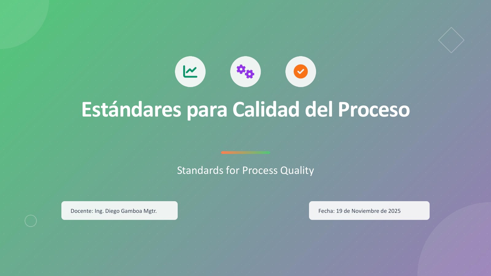

---

## Página 2

Agenda del Curso
A lo largo de esta presentación, exploraremos los siguientes
temas:
Evolución de Estándares
Un recorrido histórico por el desarrollo de los marcos de calidad
ISO 9001
Principios y requisitos del estándar global de gestión de calidad
ISO 29110
Un enfoque ágil para pequeñas entidades de desarrollo de software
Ejemplos Reales
Casos prácticos de implementación de estos estándares
Actividades Prácticas
Ejercicios guiados y talleres para aplicar los conocimientos

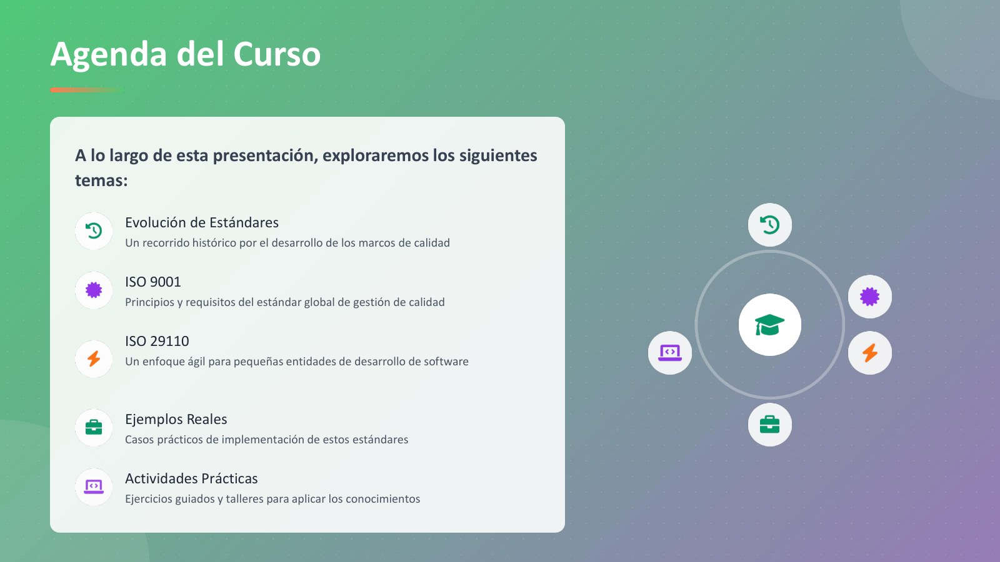

---

## Página 3

Evolución Histórica de los Estándares
La calidad, desde los inicios de la producción, ha sido un pilar fundamental para el éxito empresarial. Su concepto ha evolucionado
drásticamente, pasando de una simple inspección de productos terminados a una gestión estratégica integral que busca la excelencia
en todos los aspectos.
Inspección Manual
Supervisión directa para identificar
defectos en productos terminados.
Enfoque reactivo y basado en la
detección de errores después de la
producción.
Control Estadístico
Uso de métodos estadísticos (ej.
gráficos) para monitorear y
controlar la variabilidad en la
producción. Introducción de
métodos cuantitativos.
Revolución Total de la
Calidad
Introducción del ciclo PDCA
(Planificar, Hacer, Verificar, Actuar)
y la mejora continua por expertos
como Deming y Juran. Enfoque
proactivo.
Gestión Estratégica
Integral
Integración de metodologías como
Seis Sigma, Lean Manufacturing y
Gestión de la Calidad Total (TQM).
Enfoque en la excelencia
operativa.

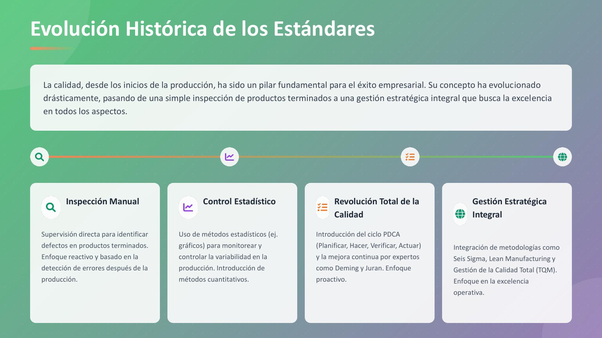

---

## Página 4

Hitos Clave en la Evolución
Un recorrido histórico por el desarrollo de los marcos de calidad:
Revolución Industrial
Enfoque: Inspección manual
Características: Supervisión directa para identificar defectos
Años 1920-1930
Enfoque: Control estadístico
Características: Métodos estadísticos para monitorear variabilidad
Años 1950-1960
Enfoque: Revolución Total de la Calidad
Características: Introducción del ciclo PDCA y mejora continua
1987
Enfoque: Normalización internacional
Características: Publicación de la primera norma ISO 9001
2000-2015
Enfoque: Enfoque estratégico
Características: Gestión de riesgos, liderazgo y mejora continua
Actualidad
Enfoque: Excelencia operativa
Características: Integración de metodologías como Seis Sigma y Lean

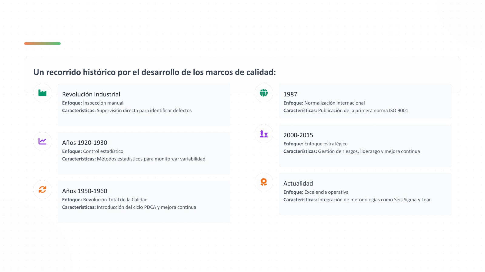

---

## Página 5

Revisiones de ISO 9000
La familia de normas ISO 9000 ha sido objeto de varias revisiones para adaptarse a las dinámicas del mercado y las mejores prácticas de gestión de
calidad. Estas revisiones han transformado el enfoque de la calidad, desde un énfasis en el aseguramiento hasta una gestión integral basada en
procesos y riesgos.
1987
Primera versión oficial
•
Publicación de ISO 9001, ISO 9002 e
ISO 9003
•
Enfocadas en modelos de garantía
de calidad
•
Diseño, desarrollo, producción,
instalación y servicio
1994
Segunda versión
•
Mantuvo la estructura de las tres
normas
•
Sin cambios destacables en ISO
9003
•
Enfoque en la consistencia del
sistema
2000
Tercera edición
•
Revisión significativa que lo
sustituyó todo
•
Enfocada en la eficiencia del SGC
•
Desarrollo organizacional
•
Concepto de "performance" en
lugar de "conformance"
2008
Cuarta edición
•
Mejora de la estabilidad
•
Alineación con la norma ISO 9001
•
Enfoque en la gestión basada en
riesgos

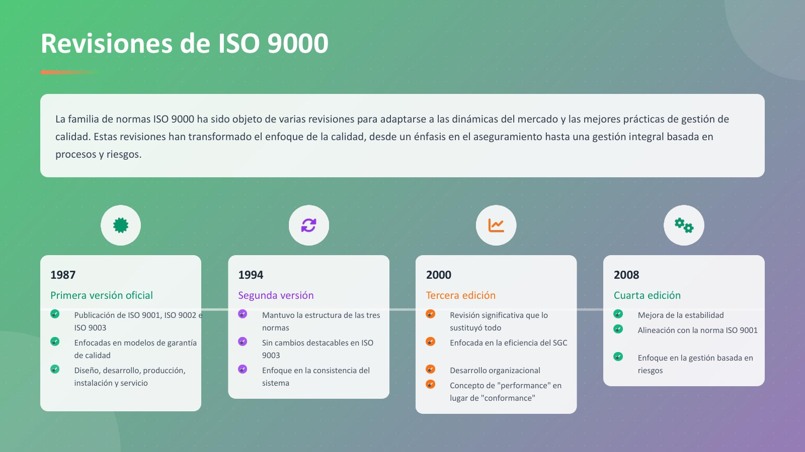

---

## Página 6

ISO 9001: Gestión Universal de Calidad
La norma ISO 9001 es el estándar de gestión de calidad más
reconocido globalmente, aplicable a cualquier organización
sin importar su tamaño, sector o naturaleza.
Su propósito es establecer requisitos para un sistema de
gestión de la calidad efectivo que garantice la satisfacción
del cliente y la mejora continua.
Reconocimiento Global
Estándar más reconocido
internacionalmente
Aplicabilidad Universal
Para cualquier organización, sin
importar su tamaño
Satisfacción del Cliente
Enfoque en cumplimiento de
expectativas
Mejora Continua
Promueve evolución constante de
procesos

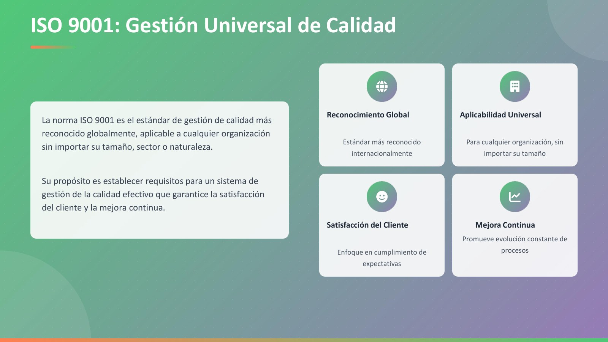

---

## Página 7

Principios Fundamentales ISO 9001
Siete principios de gestión de la calidad que guían a las organizaciones hacia la excelencia
Enfoque al Cliente
La prioridad es cumplir y superar las
expectativas del cliente, ya que su
satisfacción es un indicador clave del
rendimiento empresarial.
Liderazgo
La alta dirección debe demostrar
compromiso, establecer la policy de
calidad y crear un ambiente donde
todos los empleados se sientan
involucrados.
Compromiso de las
Personas
Involucrar y empoderar a todo el
personal es crucial, ya que son la
base para crear valor y mejorar
continuamente.
Enfoque Basado en
Procesos
Gestionar las actividades como
procesos interrelacionados permite
una mayor eficiencia y resultados
consistentes.
Mejora
La mejora continua es un objetivo
permanente, buscando
constantemente formas de optimizar
el desempeño y la eficacia del
sistema.
Toma de Decisiones
Basada en Evidencia
Las decisiones deben basarse en el
análisis de datos y la información
objetiva para asegurar su efectividad.

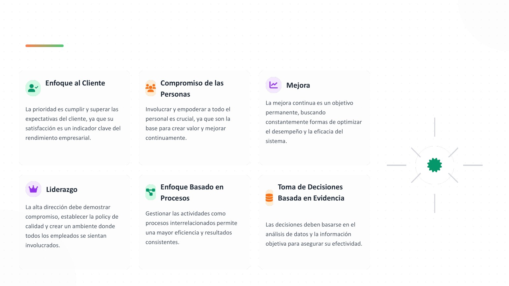

---

## Página 8

Estructura de Alto Nivel ISO 9001
Marco Común HLS
La ISO 9001:2015 adopta la Estructura de Alto Nivel (HLS), un marco común para todas las normas de sistemas de gestión ISO, lo que facilita su integración
con otros estándares. La norma se compone de 10 cláusulas, siendo las cláusulas 4 a 10 las que contienen los requisitos auditables para un Sistema de
Gestión de la Calidad (SGC).
1
Ámbito
Definición del alcance del
sistema
2
Referencias
Documentos referenciados
3
Términos
Definiciones clave
4
Contexto
Análisis de contexto y partes
interesadas
5
Liderazgo
Política de calidad y
compromiso
6
Planificación
Aspectos para considerar y
planes
7
Soporte
Recursos, competencia y
comunic.
8
Operación
Control operativo y gestión de
riesgos
9
Evaluación
Monitorización, análisis y
evaluación
10
Mejora
Acción correctiva y mejora
continua
Las cláusulas 4-10 contienen los requisitos auditables para un Sistema de Gestión de la Calidad (SGC)

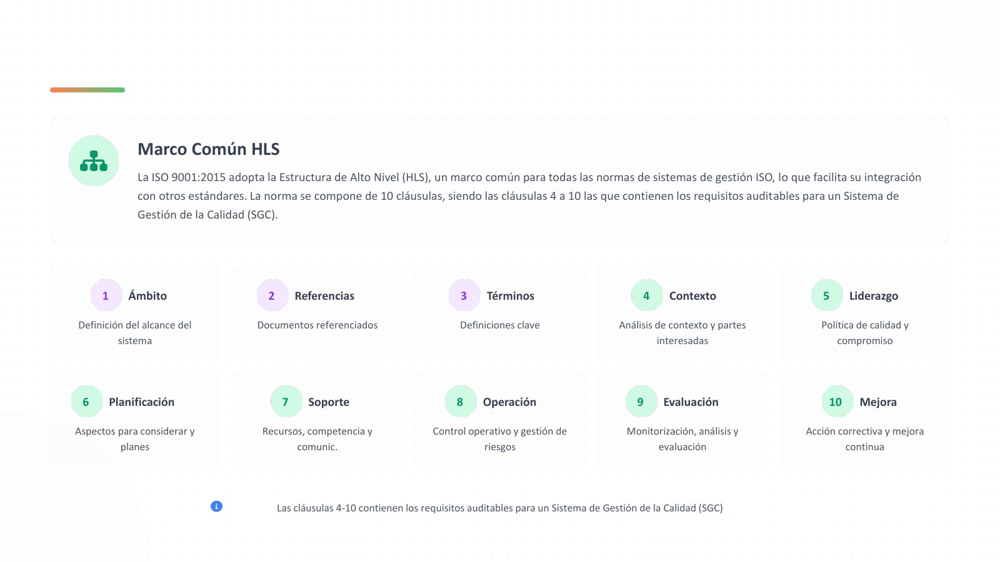

---

## Página 9

ISO 29110: Agilidad para VSe
La norma ISO/IEC 29110 es una solución diseñada específicamente para pequeñas empresas de desarrollo de software con menos de
26 personas que no desarrollan software de misión crítica.
Costo Accesible
Implementación equivalente al salario promedio
por persona durante 8 meses
Implementación Rápida
Tiempo de implementación desde unas pocas
semanas hasta 6 meses
Documentación Mínima
Conjunto reducido de prácticas y documentos
para minimizar la carga burocrática
Propósito: Hacer accesibles las buenas prácticas de ingeniería de software más avanzadas a las pequeñas empresas, adaptándolas a su tamaño
y necesidades.

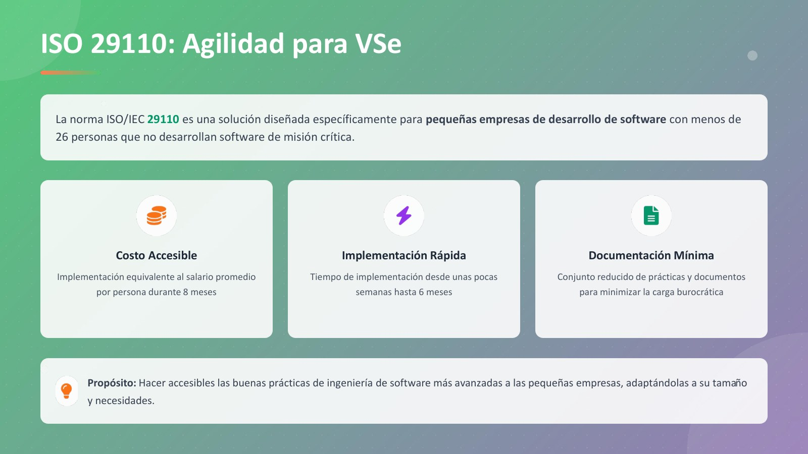

---

## Página 10

Características Clave ISO 29110
Enfoque VSEs
Dirigida a equipos de desarrollo de software con
menos de 26 personas que no desarrollan
software de misión crítica.
Costo Accesible
El costo de implementación es generalmente
equivalente al salario promedio por persona
durante 8 meses, lo que la hace viable para
pequeñas empresas.
Implementación Rápida
El tiempo de implementación puede variar desde
unas pocas semanas hasta 6 meses,
dependiendo de las condiciones y características
de la empresa.
Documentación Mínima
Define el conjunto de prácticas y documentos
mínimos necesarios, reduciendo la carga
burocrática que a menudo desalienta a las VSEs.
Mejora de Calidad
Hace accesibles las buenas prácticas de
ingeniería de software más avanzadas a las
pequeñas empresas, adaptándolas a su tamaño y
necesidades.
ISO 29110
Perfil Básico

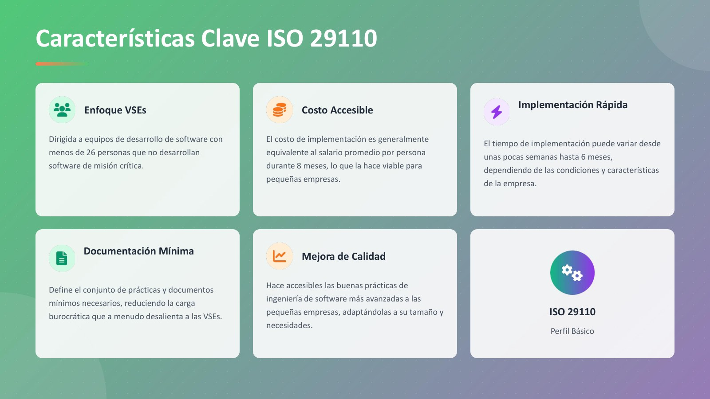

---

## Página 11

Procesos Centrales ISO 29110
Gestión de Proyectos (PM)
Lleva a cabo las tareas del desarrollo de software para cumplir objetivos en
términos de calidad, tiempo y costo.
Planeación
Definición de fechas y responsables
Seguimiento y Control
Monitoreo para tomar medidas
Gestión de Riesgos
Identificación y mitigación
Comunicación
Canal para informar avances
Implementación del Software (SI)
Realización sistemática de actividades técnicas para desarrollar o modificar
productos de software.
Análisis de Requisitos
Recopilación y refinamiento de necesidades
Diseño
Creación de arquitectura y diseño detallado
Construcción y Pruebas
Desarrollo y verificación de funcionalidad
Verificación y Validación
Aseguramiento de requisitos y estándares

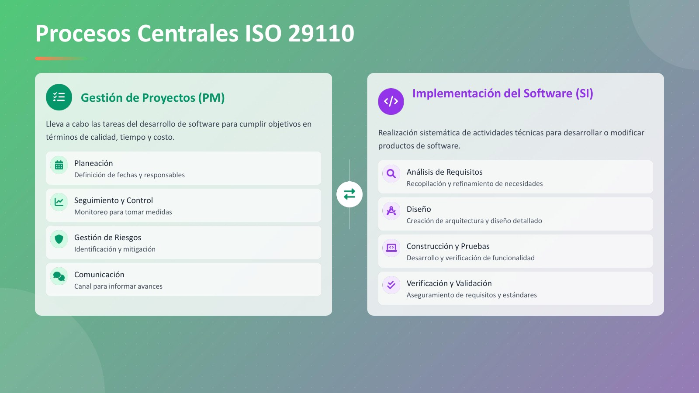

---

## Página 12

Comparativa ISO 9001 vs ISO 29110
ISO 9001
VS
ISO 29110
Alcance
Aplicable a cualquier tipo de organización, independientemente de su
tamaño o sector.
Dirigida a equipos de desarrollo de software con menos de 26 personas.
Enfoque
Enfoque basado en procesos y riesgos, con énfasis en gestión de calidad.
Enfoque adaptado a VSEs, con énfasis en agilidad y facilidad de
implementación.
Complejidad
Mayor dedicación de tiempo y recursos por su naturaleza más completa.
Tiempo de implementación que varía desde semanas hasta 6 meses.
Aplicabilidad
Puede aplicarse a organizaciones de todos los tamaños y sectores.
Diseñada específicamente para pequeñas empresas de desarrollo de
software.

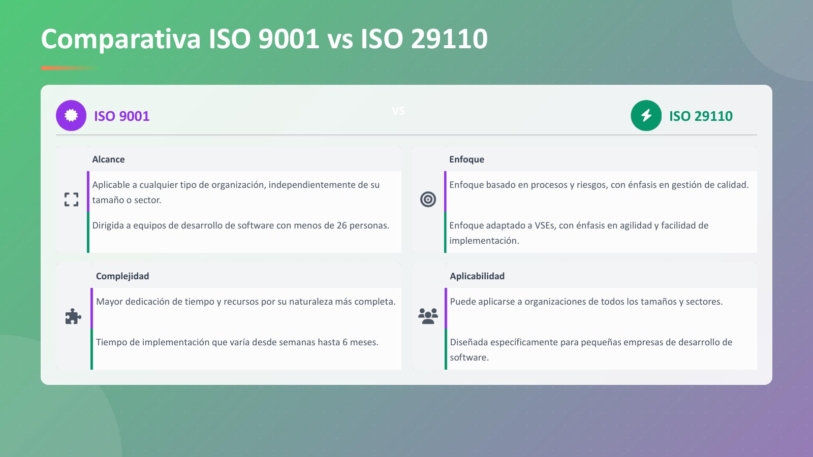

---

## Página 13

Casos de Éxito ISO 9001
Implementaciones reales con resultados medibles
TELERAD
Desafío
Mantener altos estándares de calidad en
diagnósticos por imágenes a distancia.
Solución
Certificación ISO 9001:2015, con revisión
sistemática de procesos.
Resultados
•
Adaptación de procedimientos a la realidad de
la empresa
•
Inculcación del concepto de "Satisfacción del
cliente"
•
Formalización de objetivos estratégicos
Planta de Autopartes
Desafío
Indicadores de calidad no alineados con requisitos
del cliente.
Solución
Implementación de cuadro de mando integral y
procesos estandarizados.
Resultados
Reducción de tasa de defectos:
4% anterior
0.8% posterior
Mejora significativa en calidad del producto y
cliente.
Clínica Privada
Desafío
Optimizar procedimientos de atención y mejorar
gestión de riesgos.
Solución
Optimización de procedimientos y establecimiento
de gestión de riesgos.
Resultados
Reducción del tiempo promedio de espera:
25% menos tiempo
Aumento significativo en la satisfacción del usuario.

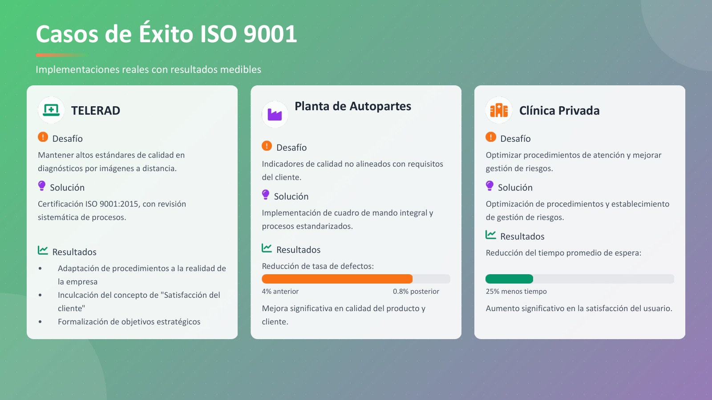

---

## Página 14

Implementaciones ISO 29110
Empresas Colombianas
Contexto: Cuatro empresas del Valle del Cauca buscaron mejorar sus
procesos.
Solución: Adopción de la norma ISO/IEC 29110.
Resultados: Mejor organización y aumento de productividad.
Pequeña Empresa Peruana
Contexto: Microempresa peruana dedicada al desarrollo de software.
Solución: Implementación del Perfil Básico de ISO/IEC 29110.
Resultados: Identificación de problemas y mejora de calidad.
Beneficios Globales Reportados
Reducción de defectos
73%
en inyección de defectos
Satisfacción del cliente
+4pts
en escala 0 a 10
Utilidad por productividad
+23%
promedio
Cumplimiento de plazos
92%
de proyectos cumplidos
Guias: https://sites.google.com/site/namfona/isoiec-standards/isoiec-29110-materials
La ISO/IEC/IEEE 29110 no es una norma de certificación (como ISO 9001 o ISO 27001).
Es una guía de buenas prácticas. No existe un organismo que “certifique” el cumplimiento de la 29110.
Su valor está en mejorar internamente la calidad y confiabilidad del desarrollo.

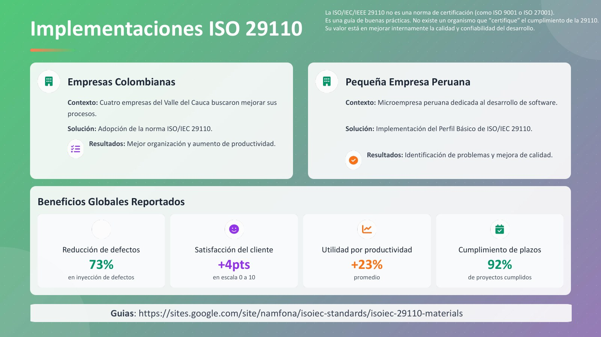

---

## Página 15

Perfiles ISO 29110
ISO/IEC 29110 - 1
Descripción
Define los términos de negocio comunes al
conjunto de Documentos de perfiles de la
Pequeña Organización, el cual introduce conceptos
de procesos, ciclo de vida de software
y estandarización; así mismo introduce las
características que debe tener la organización
para la implementación del estándar
ISO/IEC 29110 - 2
Descripción
Introduce conceptos para el perfil estandarizado de
la Ingeniería de Software para las Pequeñas
Organizaciones, además de reglas comunes para el
conjunto de documentos de perfiles de PO.
Establece la lógica detrás de la definición y
aplicación.
ISO/IEC 29110 - 3
Descripción
Determina la guía de evaluación del proceso y
determina los requerimientos mínimos que
necesita cada perfil definidos por las pequeñas
organizaciones; además contienen información útil
para desarrolladores de métodos y herramientas de
evaluación; esta parte está dirigido para personas
que están estrechamente relacionadas con el
proceso de evaluación.
ISO/IEC 29110 – 4-1
Descripción
Contiene todas las especificaciones del grupo de
perfile genéricos. El grupo es aplicable a las
pequeñas organizaciones que no desarrollan
productos de software críticos. Los perfiles de las
pequeñas organizaciones se aplican y están
dirigidos a autores o proveedores de guías y
herramientas u algún tipo de material que aporta a
la utilización del estándar
ISO/IEC 29110 – 5-1-1
Descripción
Es un perfil inicial, creado para pequeñas
organizaciones que tienen hasta 3 años de
funcionamiento inicial y que sus proyectos tengan
una duración de desarrollo inferior a los 6 meses –
persona.
ISO/IEC 29110 – 5-1-2
Descripción
Perfil Básico, es el primer documento publicado de
esta parte que provee una guía de implementación
sobre Administración e Ingeniería para del Grupo de
Perfiles Genérico descrito en ISO/IEC IS 29110 Parte
4-1. El perfil Básico describe el desarrollo de
software de una sola aplicación por un solo equipo
de proyecto sin riesgos o factores situacionales
especiales.

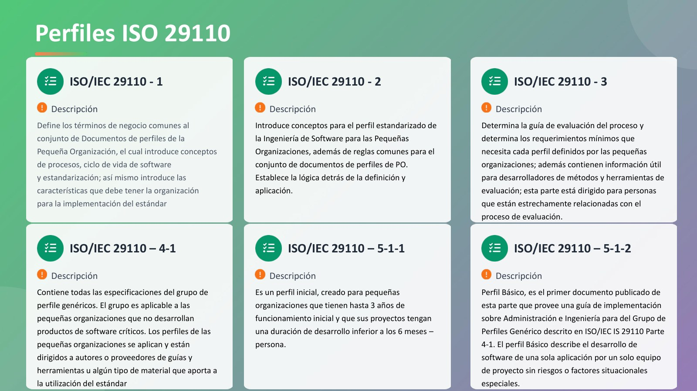

---

## Página 16

ISO 29110 – Guía VSes

**Nota visual del contenido:**
El diagrama muestra el flujo de ISO/IEC 29110 para VSEs: el **cliente** entrega el **enunciado del trabajo**; se relaciona con la **configuración de software** y el **proceso de gestión de proyecto**. Dentro de gestión de proyecto aparecen planificación, ejecución, evaluación/control y cierre. A la derecha se muestra el **proceso de implementación de software** con: inicio, análisis de requisitos, arquitectura y diseño detallado, construcción, integración/pruebas y entrega de producto.

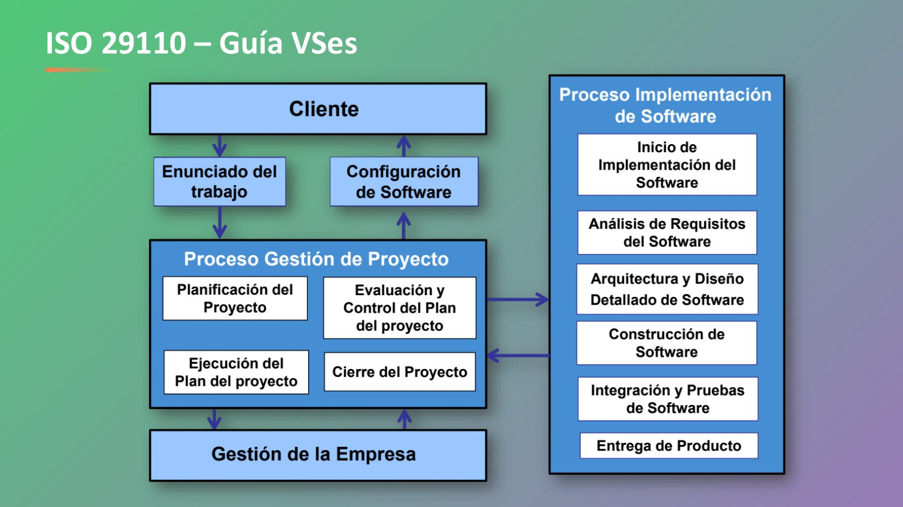

---

## Página 17

ISO 29110
Gestión del
Proyecto

**Nota visual del contenido:**
El diagrama de gestión del proyecto muestra entradas y evidencias como enunciado del trabajo, resultado de verificación, actas de reunión, acciones correctivas, solicitudes de cambio, configuración de software, repositorio del proyecto, reportes de avance, plan del proyecto, acta de aceptación y cierre del proyecto.

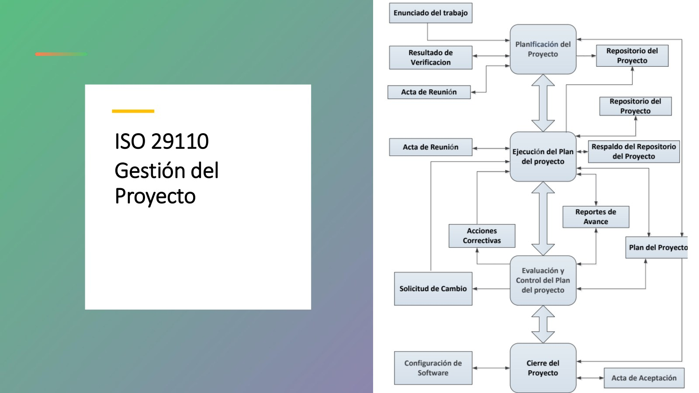

---

## Página 18

Checklist
Actividad
¿Hecho?
Evidencia esperada
Plan del proyecto creado
☐
‘plan_proyecto.pdf’
Requisitos registrados y aprobados
☐
tabla con estado "Aprobado"
Diseño del software (aunque sea mínimo)
☐
wireframes / notas
Código desarrollado y versionado
☐
repositorio en GitHub
Pruebas unitarias o de integración
☐
archivo de pruebas o captura
Verificación (revisión de artefactos)
☐
comentarios en documento o código
Validación (pruebas con usuario/cliente)
☐
checklist de pruebas
Gestión de defectos
☐
lista de bugs con estado
Cierre formal + lecciones aprendidas
☐
informe de cierre

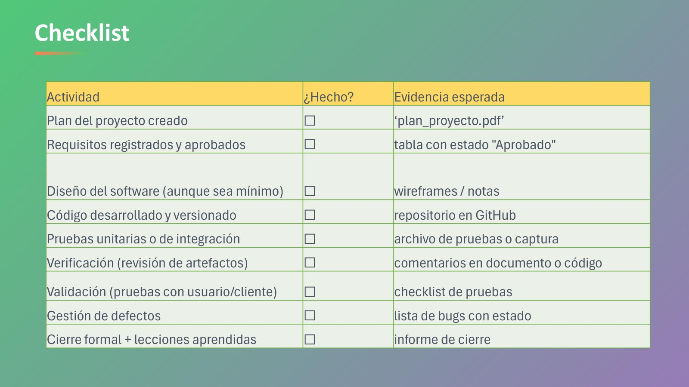

---

## Página 19

Ejercicio Guiado - Caso TELERAD
Caso de Estudio: TELERAD
Descripción: TELERAD es una empresa de telemedicina
especializada en Diagnóstico por Imágenes a Distancia.
Implementación: Implementaron y certificaron la ISO
9001:2015 para fortalecer procesos y mantener mejora
continua.
Resultados: Adaptación de procedimientos, inculcación del
concepto de "Satisfacción del cliente" y formalización del
pensamiento estrategico.
Pilar Fundamental
La calidad médica se posicionó como un pilar
fundamental en su estructura organizacional.
Preguntas para Análisis
1
Principios de ISO 9001
¿Cuáles de los siete principios de la gestión de la calidad de ISO 9001:2015 se ven
reflejados en el éxito de TELERAD? Justifique con ejemplos.
2
Enfoque al Cliente
¿Cómo el "enfoque al cliente" y la "toma de decisiones basada en la evidencia" mejoraron
la calidad de diagnósticos y satisfacción del paciente?
3
Gestión de Riesgos Operativos
¿Qué tipos de riesgos específicos (tecnológicos, de comunicación) pudieron identificar y
mitigar al implementar la norma ISO 9001 en su servicio de telemedicina?

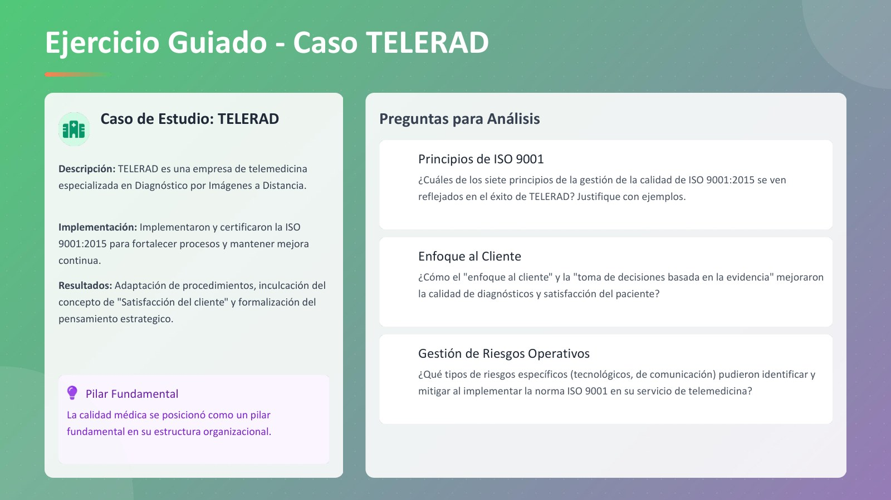

---

## Página 20

Taller Práctico - AppMóvil Innova
Caso de Estudio
"AppMóvil Innova" es una pequeña empresa de desarrollo de aplicaciones móviles con 15 empleados. Han notcido un aumento en las quejas de clientes sobre la
calidad de sus productos y el incumplimiento de los plazos de entrega. La dirección está comprometida a mejorar su reputación y eficiencia, pero cuenta con recursos
limitados.
1. Selección del Estándar
Justifiquen si debería optar por ISO 9001 o
ISO/IEC
Argumenten basándose en características y
aplicabilidad
Considern el tamaño de la empresa y su
sector
2. Plan Básico de
Implementación
Si optan por ISO/IEC, elaboren un plan que
incluya:
Gestión de Proyectos (PM): Describan 2
actividades clave
Implementación del Software (SI):
Describan 2 actividades clave
3. Beneficios Medibles
Listen 3 beneficios medibles específicos que
esperan obtener en 6 meses:
Aumento de satisfacción del cliente
Reducción de defectos o tiempos de entrega
Mejora en la productividad o rentabilidad
Tiempo estimado: 20-30 minutos

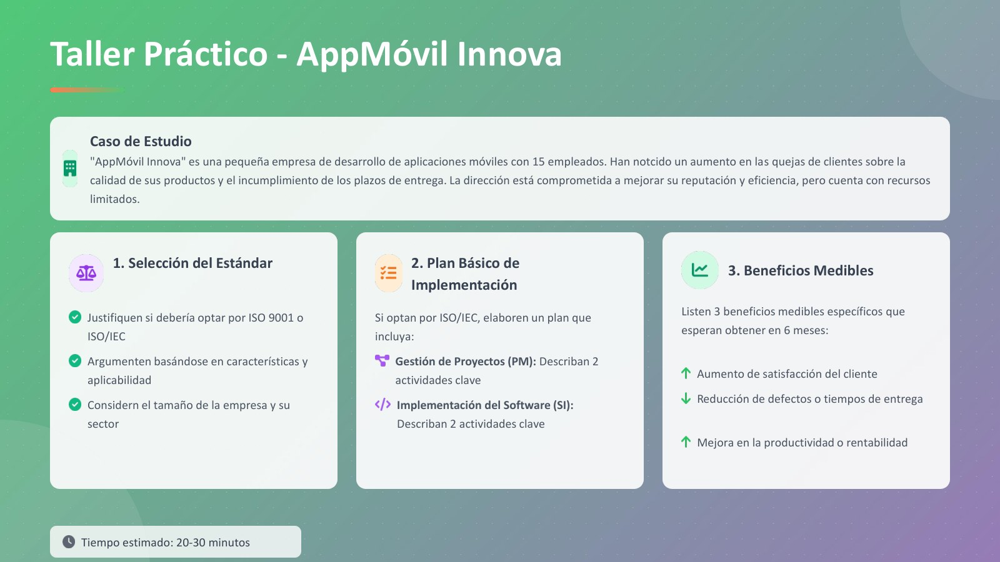

---

## Página 21

Conclusiones y Próximos Pasos
Evolución de los Estándares
Transformación de la gestión empresarial, pasando de inspección a
enfoque estratégico integral que busca la excelencia organizacional.
ISO 9001: Estándar Global
Norma global para la gestión de calidad, aplicable a cualquier
organización, establece requisitos para sistemas efectivos que
garantizan satisfacción al cliente.
ISO 29110: Solución Ágil
Solución ágil y adaptada para pequeñas empresas de desarrollo de
software, con enfoque en VSEs y características de implementación
rápida.
Competitividad Empresarial
Ambos marcos impulsan mejora continua, optimizan procesos y
reducen costos, demostrando que la calidad es un pilar esencial
para la competitividad.
Próximos Pasos
Implementar los estándares en organizaciones de
diferentes sectores
Desarrollar capacidades para la mejora continua
basada en evidencia
Adaptar los marframes a las necesidades
específicas de cada organización
Docente: Diego Gamboa | Fecha: 19 de Noviembre de 2025

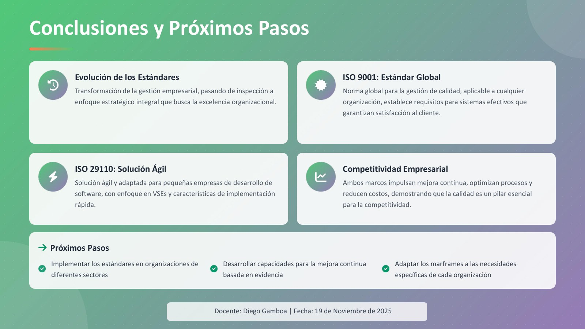
