# Estándares para la Calidad del Producto de Software: ISO/IEC 9126 y CISQ

- **Fuente original:** 2. Estándares para la Calidad del Producto de Software.pptx
- **Total de diapositivas:** 23
- **Nota de conversión:** se conserva una imagen de cada diapositiva para no perder tablas, gráficos, diagramas ni elementos visuales.

---

## Diapositiva 1

software.quality{ }

ISO/IEC 9126;

CISQ.standard();

metrics.calculate();

Estándares para la Calidad del Producto de Software

Un Enfoque Práctico con ISO/IEC 9126 y CISQ

Docente: Diego Gamboa

Fecha: 24 de Noviembre de 2025

Informe de Calidad de Software

Página 1

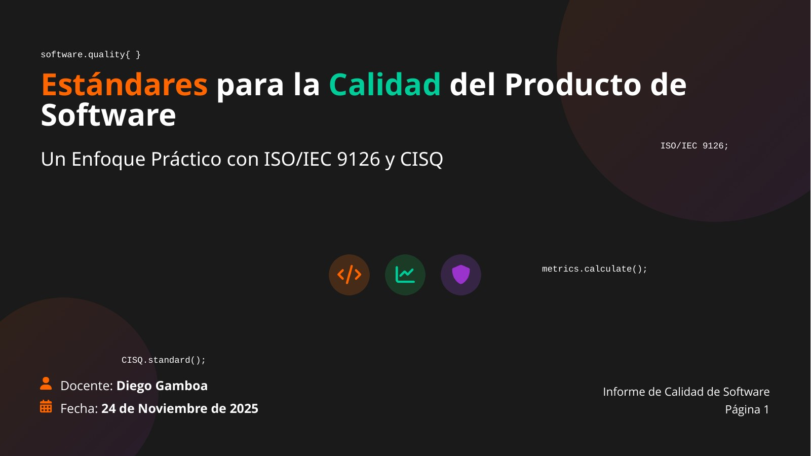

---

## Diapositiva 2

Agenda de la Presentación

Introducción a la Calidad

Importancia y conceptos básicos

Estándar ISO/IEC 9126

Modelo de calidad, características y métricas

Estándares CISQ

Características de calidad y medición de deuda técnica

Ejemplos y Casos Reales

Aplicaciones prácticas en empresas y estudios de caso

Actividades Prácticas

Ejercicio para docentes y taller para estudiantes

Conclusiones

Resumen y preguntas

24 de Noviembre de 2025

Página 2 de 25

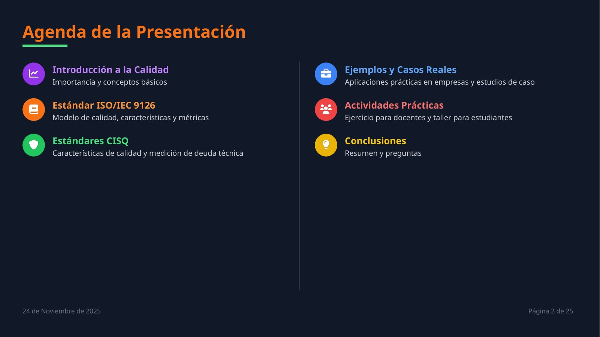

---

## Diapositiva 3

Importancia de la Calidad del Software

La calidad del software es un pilar fundamental para el éxito en el panorama tecnológico actual. Los estándares de calidad permiten evaluar, gestionar y mejorar el software de forma objetiva.

Satisfacción del Cliente

Un producto de alta calidad satisface las expectativas del cliente y mejora la experiencia.

Eficiencia Operativa

Software de calidad impulsa la eficiencia operativa y reduce los costos de mantenimiento.

Fortalecimiento de Marca

La calidad consistently deliverada impulsa la reputación de la empresa.

Evaluación Objeta

Los estándares permiten una evaluación objetiva y medible de la calidad del software.

24 de Noviembre de 2025

Página 3 de 25

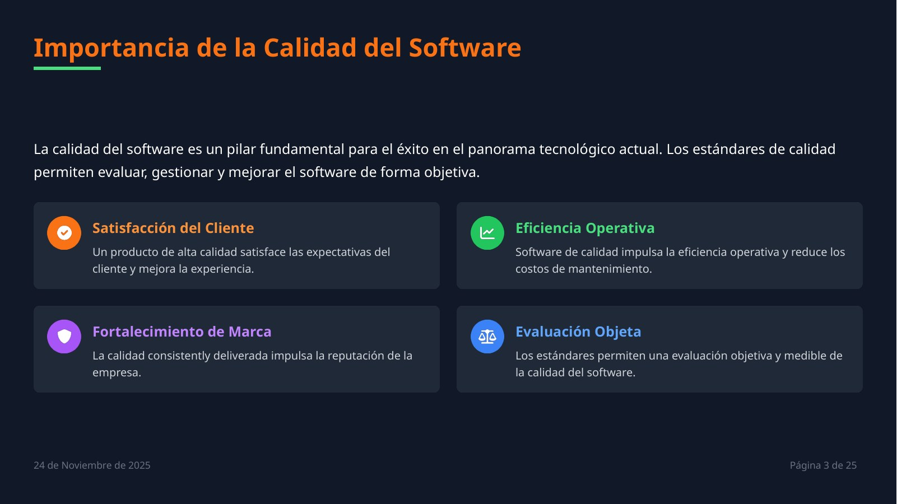

---

## Diapositiva 4

Introducción al Estándar ISO/IEC 9126

Fundamentos

Estándar internacional fundamental para evaluación de calidad del software

Abordó sesgos humanos que afectan negativamente la entrega y percepción de proyectos

Estableció definiciones claras de "éxito" y prioridades medibles

Evolución

Reemplazado por la serie ISO/IEC 25000 (SQuaRE), específicamente ISO/IEC 25010:2011

ISO/IEC 9126

2001

ISO/IEC 25000

2011

Características Clave

Funcionalidad

Evalúa si el software cumple con las funciones para las que fue diseñado

Fiabilidad

Capacidad del software de mantener su nivel de desempeño bajo condiciones determinadas

Usabilidad

Facilita la comprensión, el aprendizaje y la operación del software

Eficiencia

Determina el uso adecuado de los recursos por parte del software

24 de Noviembre de 2025

Página 4 de 25

ISO/IEC 9126-1: Modelo de calidad - Qué evaluar
ISO/IEC 9126-2: Métricas externas - Cómo medir en funcionamiento
ISO/IEC 9126-3: Métricas internas - Cómo medir internamente
ISO/IEC 9126-4: Matrices de calidad en uso - Cómo medir para el usuario

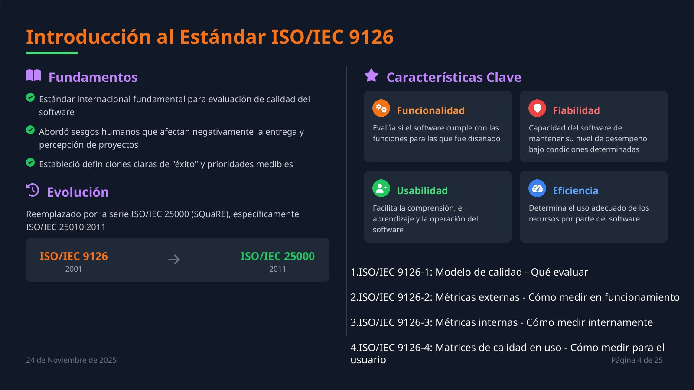

---

## Diapositiva 5

Modelo de Calidad ISO/IEC 9126

El estándar ISO/IEC 9126 clasifica la calidad del software en seis características principales

Funcionalidad

Evalúa si el software cumple con las funciones para las que fue diseñado

Fiabilidad

Indica la capacidad del software de mantener su nivel de desempeño bajo condiciones determinadas

Usabilidad

Facilita la comprensión, el aprendizaje y la operación del software

Eficiencia

Determina el uso adecuado de los recursos por parte del software

Mantenibilidad

Mide la facilidad con la que el software puede ser modificado para corregir fallos o mejorar

Portabilidad

Capacidad del software para ser transferido de un entorno a otro

24 de Noviembre de 2025

Página 5 de 25

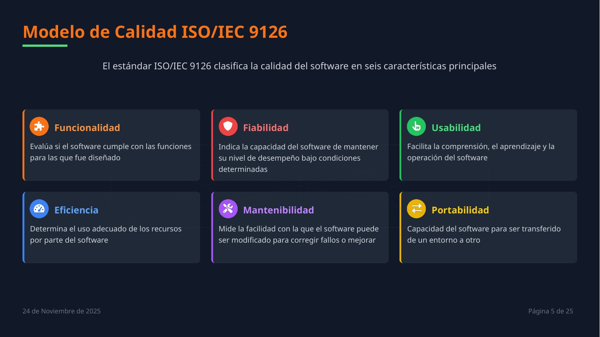

---

## Diapositiva 6

Funcionalidad y Fiabilidad

Características principales del modelo ISO/IEC 9126

Funcionalidad

Evalúa si el software cumple con las funciones para las que fue diseñado.

Sub-características:

Adecuación:

Cumple con las necesidades y expectativas del usuario

Exactitud:

Precisión y corrección de los resultados obtenidos

Interoperabilidad:

Capacidad de interactuar con otros sistemas

Seguridad:

Protección contra accesos no autorizados

Conformidad funcional:

Adherencia a los estándares y especificaciones

Fiabilidad

Indica la capacidad del software de mantener su nivel de desempeño bajo condiciones determinadas.

Sub-características:

Madurez:

Capacidad para detectar y corregir fallos

Tolerancia a fallos:

Capacidad para operar correctamente ante errores

Recuperabilidad:

Capacidad para restaurar el funcionamiento normal

Conformidad de la fiabilidad:

Adherencia a los objetivos de fiabilidad establecidos

ISO/IEC 9126:2001

Página 6 de 25

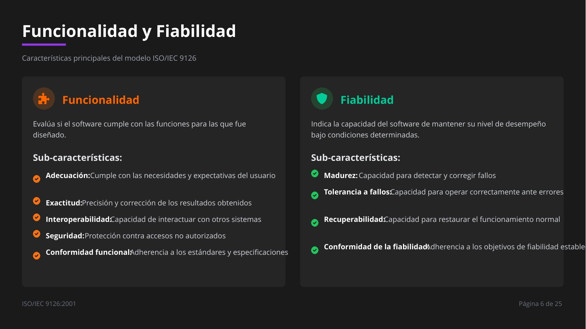

---

## Diapositiva 7

Usabilidad y Eficiencia

Segunda y cuarta características del modelo ISO/IEC 9126

Usabilidad

Facilita la comprensión, el aprendizaje y la operación del software.

Subcaracterísticas:

Entendibilidad

Aprendibilidad

Operatividad

Atractivo

Conformidad de la usabilidad

Métrica Ejemplo:

Tiempo promedio para completar una transacción (desde la búsqueda hasta el pago)

Eficiencia

Determina el uso adecuado de los recursos por parte del software.

Subcaracterísticas:

Comportamiento en el tiempo

Utilización de recursos

Conformidad de la eficiencia

Métrica Ejemplo:

Tiempo de respuesta de las páginas y elrendimiento del servidor durante picos de tráfico

ISO/IEC 9126:2001

Página 7 de 25

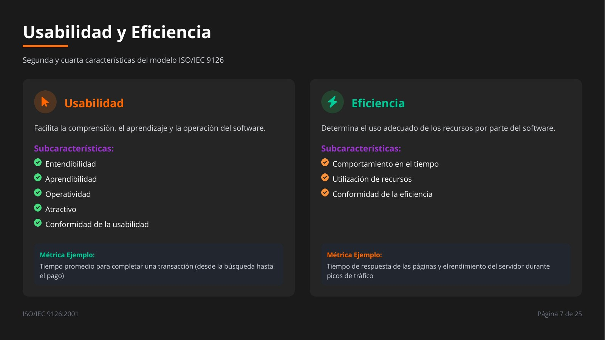

---

## Diapositiva 8

Mantenibilidad y Portabilidad

Mantenibilidad

Facilidad con la que el software puede ser modificado para corregir fallos o mejorar su functionality.

Subcaracterísticas:

Analizabilidad

Cambiabilidad

Estabilidad

Examinabilidad

Portabilidad

Capacidad del software para ser transferido de un entorno a otro sin pérdidas de functionality.

Subcaracterísticas:

Adaptabilidad

Instalabilidad

Coexistencia

Remplazabilidad

ISO/IEC 9126 - Características de Calidad

Página 8 de 25

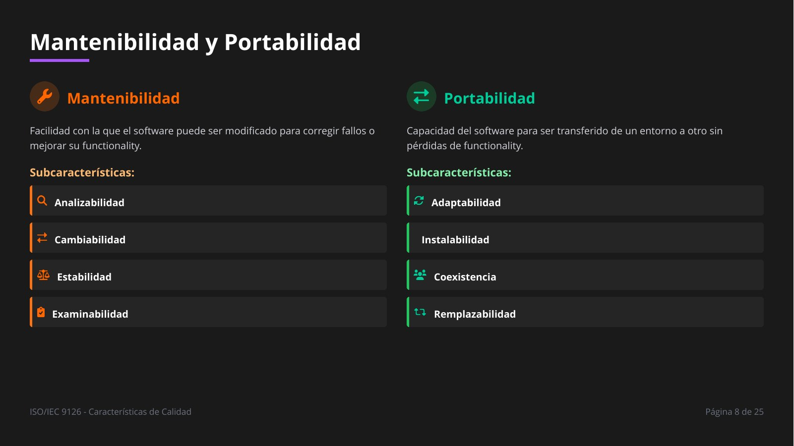

---

## Diapositiva 9

Calidad Interna vs Externa

Calidad Interna

Propiedades estáticas del software

No requiere ejecución para medirse

Enfoque en aspectos técnicos del código

Métricas aplicadas durante desarrollo

Calidad Externa

Aplica al software en ejecución

Evalúa el comportamiento del software

Enfoque en efectividad y satisfacción

Métricas por pruebas y user interaction

Calidad en Uso

Medición en condiciones reales

Experiencia del usuario final

Relación con calidad externa

Indicador de éxito del negocio

Calidad Interna

Calidad Externa

Calidad en Uso

24 de Noviembre de 2025

Página 9 de 25

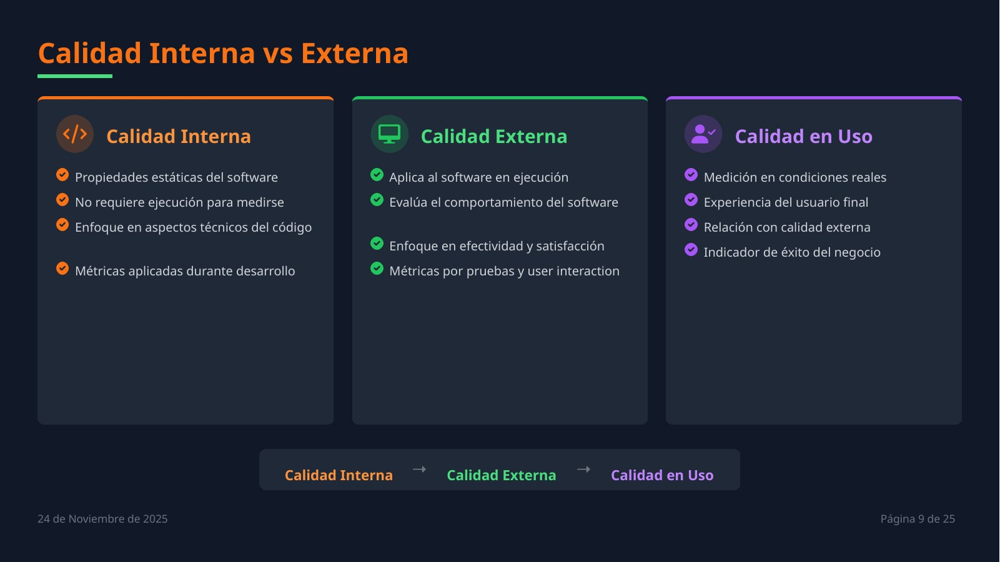

---

## Diapositiva 10

Métricas del Estándar ISO/IEC 9126

Las métricas son medidas cuantitativas de un atributo del software. ISO/IEC 9126 proporciona un marco para definir métricas que evalúan el grado de presencia de los atributos de calidad.

Métricas Internas

No dependen de la ejecución del software (medidas estáticas). Se aplican durante el desarrollo.

Propósito

Medir calidad de entregables intermedios y predecir calidad del producto final.

Aplicación

A partir del análisis de código fuente y documentación.

Ejemplo

Complexidad ciclomática, líneas de código, densidad de defectos.

Métricas Externas

Aplicables al software en ejecución. Evalúan el comportamiento desde la perspectiva del usuario.

Propósito

Evaluar efectividad, eficiencia y satisfacción del usuario final.

Aplicación

A partir de pruebas y interacción del usuario con el software.

Ejemplo

Tiempo de respuesta, tasa de éxito, tiempo para completar tareas.

ISO/IEC 9126:2001 - Ingeniería de software - Calidad del producto

Página 10 de 25

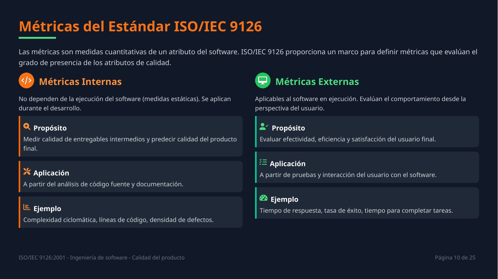

---

## Diapositiva 11

Ejemplos Prácticos de Métricas

Ejemplos de métricas del estándar ISO/IEC 9126 organizadas por característica, subcaracterística, tipo de métrica, propósito y método de aplicación:

Característica

Subcaracterística

Tipo de Métrica

Métrica de Ejemplo

Propósito

Método de Aplicación

Funcionalidad

Adecuación

Externa

Porcentaje de funciones básicas disponibles

Evaluar si el software cumple con las funciones esperadas

Análisis heurístico

Usabilidad

Entendibilidad

Interna

Nivel de complejidad cicломática

Evaluar la facilidad de comprensión del software

Análisis del código fuente

Eficiencia

Comportamiento en el tiempo

Externa

Tiempo de respuesta promedio

Medir el uso adecuado de los recursos por parte del software

Perímetros de carga y estrés

Mantenibilidad

Analizabilidad

Interna

Número de módulos afectados por cambios

Facilitar la comprensión y localización de fallos

Análisis de dependencias

ISO/IEC 9126 - Métricas de Calidad del Software

Página 11 de 25

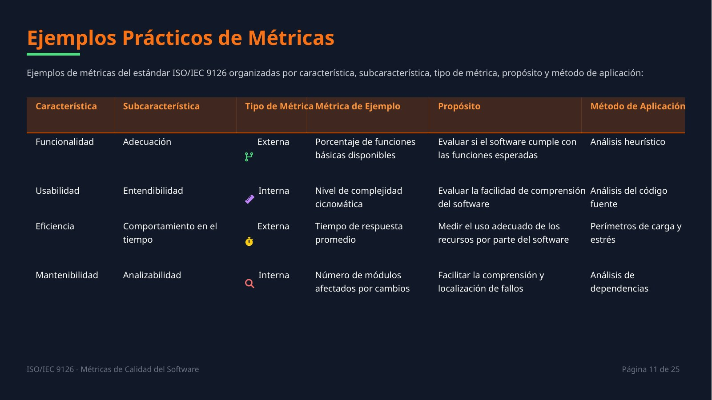

---

## Diapositiva 12

Introducción a los Estándares CISQ

Consortium for Information & Software Quality

Organización líder en el avance de estándares medibles para mejorar la calidad, fiabilidad y seguridad del software.

Objetivo Principal

Estandarizar la medición automatizada del software directamente desde el código fuente, abordando desafíos críticos como:

Debilidades del software

Vulnerabilidades de ciberseguridad

Deuda técnica

Enfoque de Medición

Automatizada

Medición directa desde el código fuente sin necesidad de ejecución.

Temprana

Permite identificar problemas en las primeras etapas del desarrollo.

Estandarizada

Facilita la comparación y evaluación objetiva de calidad entre proyectos.

24 de Noviembre de 2025

Página 12 de 25

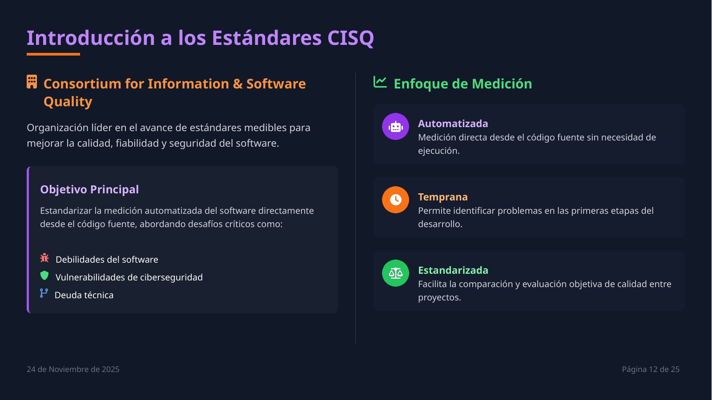

---

## Diapositiva 13

Características de Calidad CISQ

Seguridad

Mide las debilidades en el código fuente que representan vulnerabilidades de seguridad, incluyendo las identificadas por CWE/Sans Institute Top 25 y OWASP Top 10.

Fiabilidad

Evalúa las debilidades en el código fuente que impactan la disponibilidad, tolerancia a fallos y capacidad de recuperación del software.

Eficiencia de Rendimiento

Cuantifica las debilidades en el código fuente que afectan el tiempo de respuesta y la utilización de recursos como el procesador y la memoria.

Mantenibilidad

Mide las debilidades en el código fuente que influyen en la comprensibilidad, capacidad de cambio, capacidad de prueba y escalabilidad del software.

Consortium for Information & Software Quality (CISQ)

Página 13 de 25

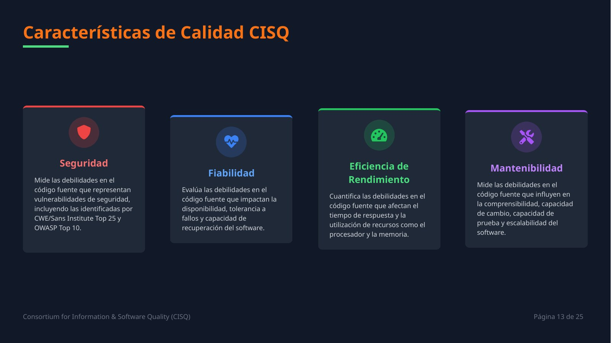

---

## Diapositiva 14

Medición de Deuda Técnica

Definición

La Deuda Técnica se define como el esfuerzo de mantenimiento correctivo necesario debido a las debilidades de calidad del código que persisten en una aplicación de software.

Estándar ISO/IEC 5055:2021

Permite medir la estructura interna de un producto de software basándose en cuatro factores críticos de negocio:

ISO/IEC 5055:2021

Seguridad

Factor crítico de negocio

Fiabilidad

Factor crítico de negocio

Eficiencia

Factor crítico de negocio

Mantenibilidad

Factor crítico de negocio

Beneficios de la Medición

Identificación proactiva de problemas

Ahorros de costos en el ciclo de desarrollo

Entregables de alta calidad

ISO/IEC 5055:2021 - Medición de Deuda Técnica

Página 14 de 25

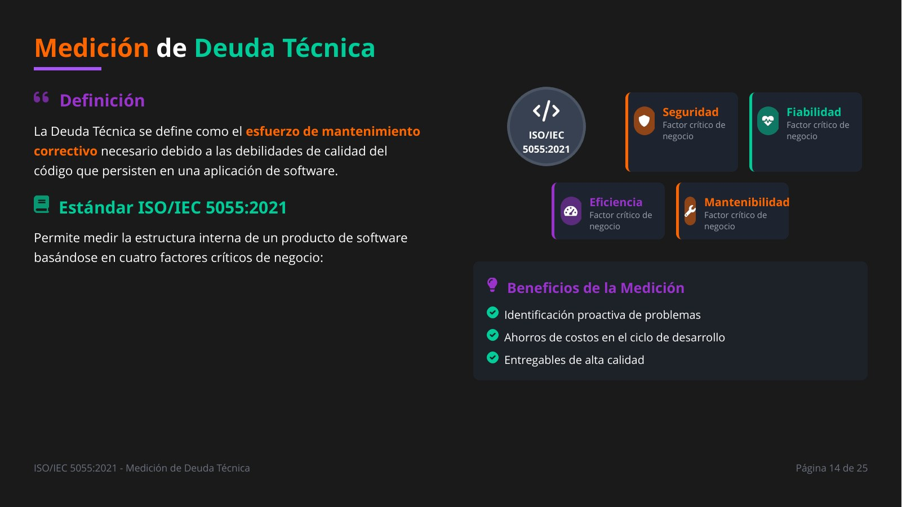

---

## Diapositiva 15

Caso Real:

Empresa de E-commerce

Implementación de métricas de usabilidad y eficiencia para optimización de plataforma de ventas

Problema

Usuarios reportaban dificultades para completar compras

Tiempos de carga lentos en ciertas secciones del sitio

Métricas Aplicadas

Usabilidad (ISO/IEC 9126)

Tiempo promedio para completar una transacción

Número de clics para añadir un producto al carrito

Encuestas de satisfacción del cliente (CSAT)

Eficiencia (ISO/IEC 9126)

Tiempo de respuesta de las páginas de productos

Rendimiento del servidor durante picos de tráfico

Resultados

Tras identificar cuellos de botella y optimizar la carga de imágenes y scripts:

Reducción del tiempo de transacción

20%

Mejora en satisfacción del cliente

15%

Aumento correspondiente en las ventas

Conclusión: La aplicación de métricas basadas en ISO/IEC 9126 permitió identificar y resolver cuellos de botella, mejorando la experiencia de usuario y los resultados comerciales.

24 de Noviembre de 2025

Página 15 de 25

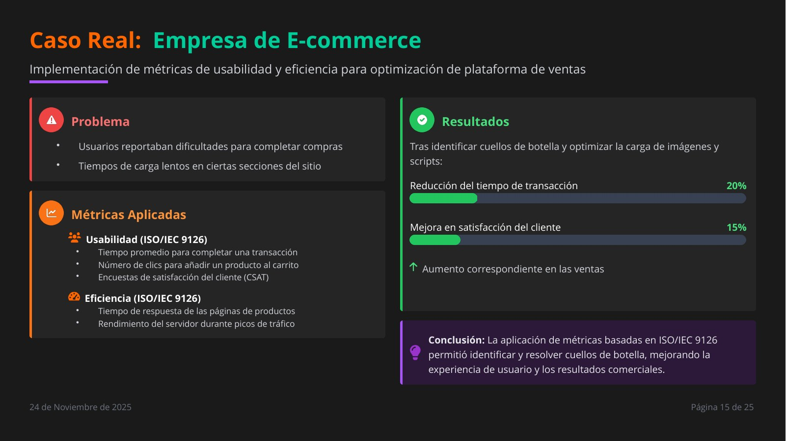

---

## Diapositiva 16

Caso Real: Entidad Financiera

Problema

Amenazas de ciberataques crecientes

Regulaciones de seguridad estrictas

Solución CISQ

Análisis automatizado de código

Medición de debilidades de seguridad

Herramientas para detectar vulnerabilidades

Métricas Aplicadas

MTTV: Tiempo medio para remediar vulnerabilidades

Densidad de defectos: Relacionados con seguridad

Resultados

Reducción del 40%

de fallos de seguridad detectados

ISO/IEC 9126 & CISQ

Página 16 de 25

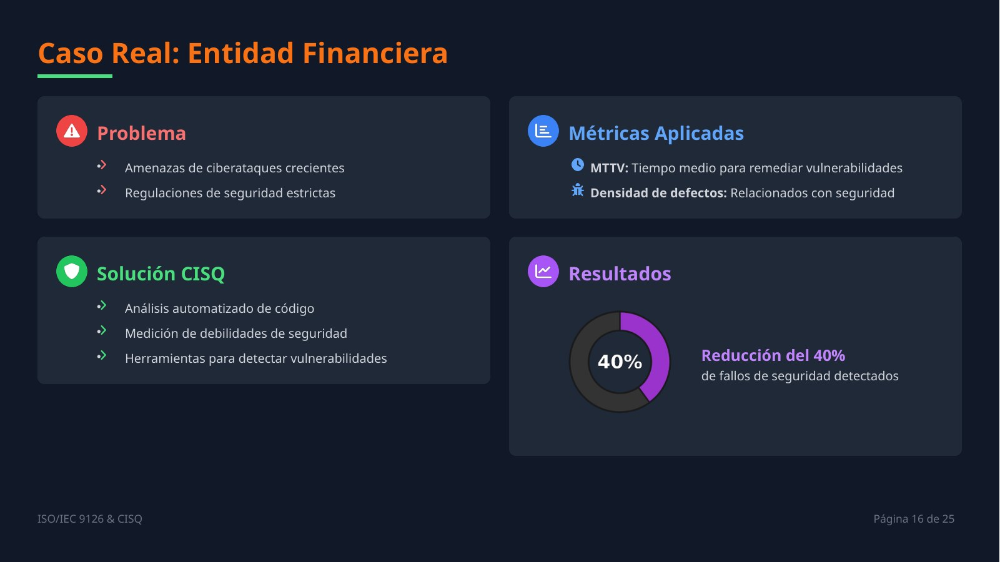

---

## Diapositiva 17

Caso de Estudio: Pruebas de Rendimiento

Problema Identificado

Durante las pruebas de rendimiento en un proyecto de cliente, se observaron tiempos de respuesta del sistema que superaban las expectativas. El análisis reveló que la causa principal era la saturación del servidor de base de datos debido a la carga generada durante las pruebas de concurrencia.

Análisis de Impacto

Impacto negativo en la experiencia del usuario

Percepción de baja calidad del software

Necesidad de optimización inmediata

Soluciones Propuestas

Ampliar Capacidad del Servidor

Incrementar los recursos del servidor o migrar a una infraestructura más robusta para gestionar eficientemente altas cargas.

Optimizar Consultas y Operaciones

Revisar e implementar índices adecuados, eliminar consultas redundantes y optimizar operaciones de lectura y escritura.

Monitoreo Continuo

Establecer un proceso de monitoreo constante para detectar rápidamente degradaciones y aplicar medidas correctivas.

Relación con estándares: Eficiencia y Fiabilidad

Página 18 de 25

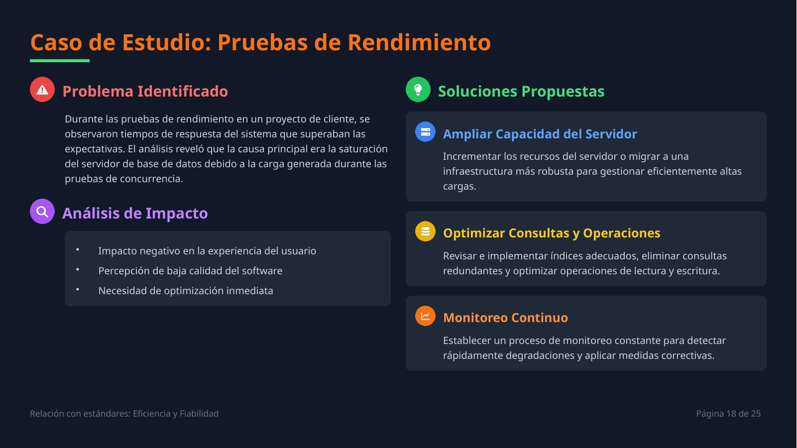

---

## Diapositiva 18

Taller para Estudiantes

Evaluación colaborativa de calidad en plataformas de streaming

Instrucciones del Taller

1

Formación de Grupos

Dividirse en grupos de 3-4 estudiantes. Cada grupo enfocará una característica de calidad.

2

Identificación de Subcaracterísticas

Identificar 3 subcaracterísticas clave para la plataforma de streaming.

3

Propuesta de Métricas

Proponer 2 métricas específicas para medir cada subcaracterística.

4

Presentación y Discusión

Presentar hallazgos y métricas propuestas. Discutir aplicabilidad y efectividad.

Características de Calidad

Funcionalidad

¿Cumple con las funciones básicas de streaming?

Adecuación funcional: Funciones disponibles vs. esperadas

Interoperabilidad: Funcionamiento en diferentes dispositivos

Usabilidad

¿Es fácil de usar y atractivo para los usuarios?

Aprendibilidad: Tiempo para completar una transferencia

Operatividad: Eficiencia de navegación y reproducción

Rendimiento

¿Proporciona una experiencia fluida y rápida?

Comportamiento en el tiempo: Tiempos de carga

Utilización de recursos: Consumo de batería y datos

Sugerencia: Utilizar métricas cuantificables para resultados objetivos

Página 20 de 25

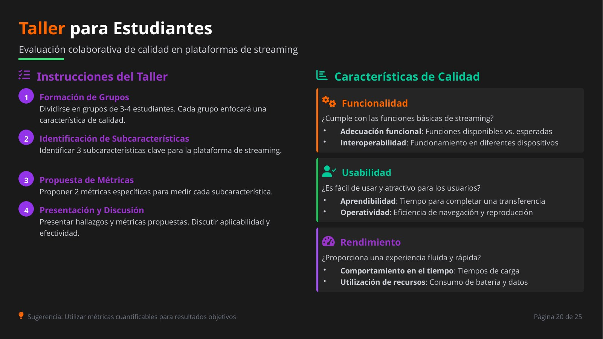

---

## Diapositiva 19

Desarrollo del Ejercicio Práctico

Metodología para el análisis de calidad de aplicaciones móviles

1. Selección de la Aplicación

Elija una aplicación móvil de banca familiar

Garantice acceso igualitario para todos los estudiantes

Preferiblemente aplicaciones populares del mercado

2. Definición de Objetivos de Calidad

2-3 objetivos específicos alineados con ISO/IEC 9126 o CISQ

Ejemplos: Usabilidad, Seguridad, Eficiencia

Formule objetivos medibles y relevantes

3. Identificación de Métricas Aplicables

Basadas en los objetivos de calidad definidos

Métricas concretas y medibles

Ejemplos: Tiempo de carga, complejidad de contraseña, etc.

4. Recolección de Datos y Análisis

Pruebas manuales o simulaciones para recolectar datos

Uso de herramientas simples (cronómetros, observadores)

Comparación con expectativas o con otras aplicaciones

5. Discusión y Mejoras Propuestas

Presentación de hallazgos por parte de los estudiantes

Identificación de áreas de mejora

Propuesta de soluciones justificadas con datos

Consejo para el Docente

Enfatice cómo la aplicación de estándares ayuda a objetivar la evaluación y a comunicar la calidad de manera efectiva. Establezca un tiempo límite para cada fase del ejercicio.

Ejercicio Práctico para Docentes

Página 21 de 25

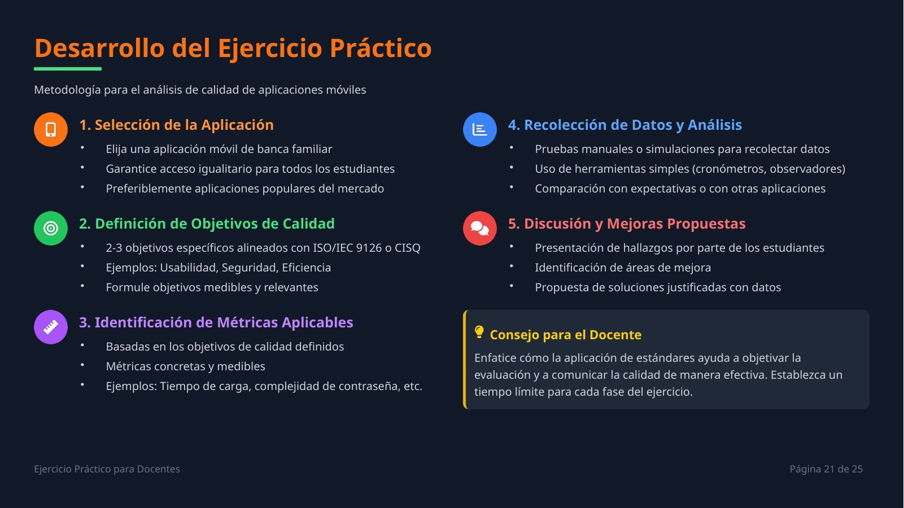

---

## Diapositiva 20

Implementación del Taller Estudiantil

1

Formación de Grupos

Dividir la clase en grupos pequeños (3-4 estudiantes)

Cada grupo seleccionará una plataforma de streaming (Netflix, Spotify, etc.)

Asignar una característica de calidad principal a cada grupo (Funcionalidad, Usabilidad, Rendimiento)

2

Identificación de Subcaracterísticas

Dentro de la característica asignada, cada grupo identificará 3 subcaracterísticas clave

Ejemplos para cada característica:

3

Propuesta de Métricas

Para cada una de las 3 subcaracterísticas identificadas, el grupo propondrá 2 métricas específicas

Las métricas deben ser cuantificables y realistas para una evaluación heurística

Ejemplos para Funcionalidad - Adecuación funcional:

4

Presentación y Discusión

Cada grupo presentará sus hallazgos y métricas propuestas

Realizar discusión grupal para comparar enfoques y métricas

Documentar resultados y conclusiones para informe final

24 de Noviembre de 2025

Página 22 de 25

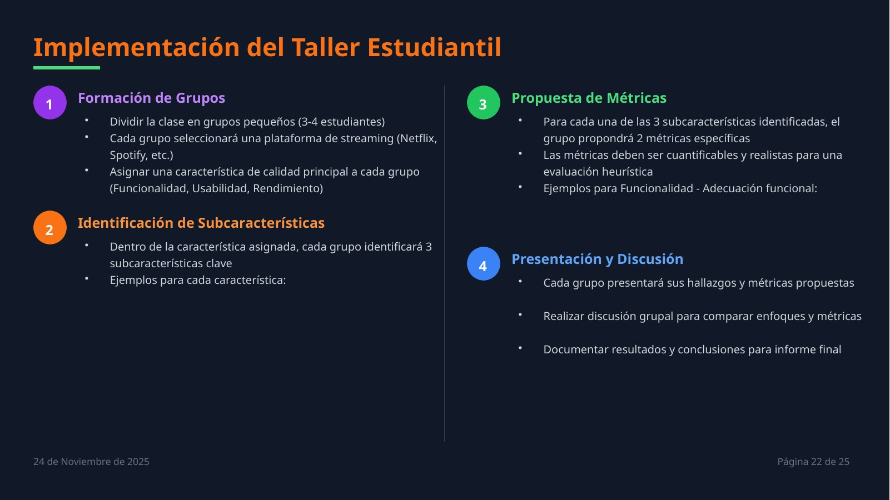

---

## Diapositiva 21

Resultados Esperados y Evaluación

Criterios de Evaluación

Análisis de Métricas

Capacidad para identificar y aplicar métricas de calidad adecuadas según los objetivos definidos

Interpretación de Resultados

Habilidad para analizar datos recolectados y extraer conclusiones significativas sobre la calidad del software

Propuestas de Mejora

Capacidad para identificar áreas de mejora y proponer soluciones basadas en estándares de calidad

Métricas de Éxito

Participación

Nivel de participación activa en los talleres y ejercicios prácticos

Cumplimiento

Adherencia a los estándares y procedimientos definidos durante las actividades

Comprensión

Grado de comprensión de los conceptos de calidad del software y estándares aplicables

Resultados

Mejora en la calidad del software evaluado antes y después de la implementación

24 de Noviembre de 2025

Página 23 de 25

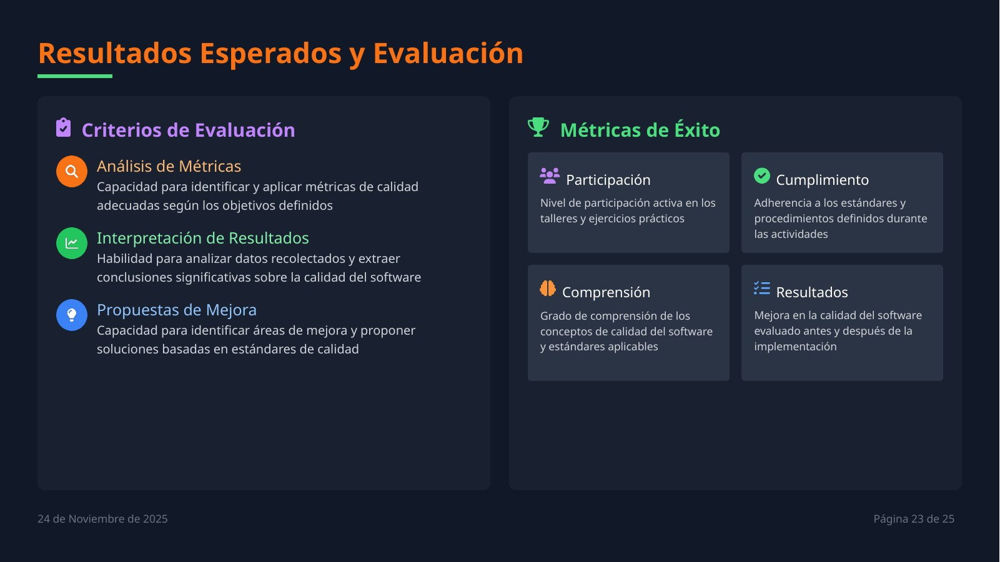

---

## Diapositiva 22

Conclusiones y Puntos Clave

Transformación de la Calidad

Transforma la calidad de un concepto subjetivo a una disciplina medible y gestionable, permitiendo evaluar objetivamente la calidad del software.

Evaluación Objektiva

Proporcionan herramientas y métricas para evaluar de manera objetiva las características internas y externas del software, asegurando la entrega de productos robustos.

Competitividad

La adopción de estándares de calidad es crucial para la competitividad y el éxito a largo plazo en la industria del software, mejorando la reputación y reduciendo costos.

Satisfacción del Usuario

Los estándares ayudan a asegurar que los productos finales no solo satisfagan las expectativas del usuario, sino que también impulsen la eficiencia operativa y reduzcan costos.

Los marcos como ISO/IEC 9126 y CISQ proporcionan las herramientas y métricas necesarias para evaluar de manera objetiva las características internas y externas del software, permitiendo a las organizaciones no solo identificar áreas de mejora, sino también asegurar la entrega de productos robustos, eficientes y seguros.

24 de Noviembre de 2025

Página 24 de 25

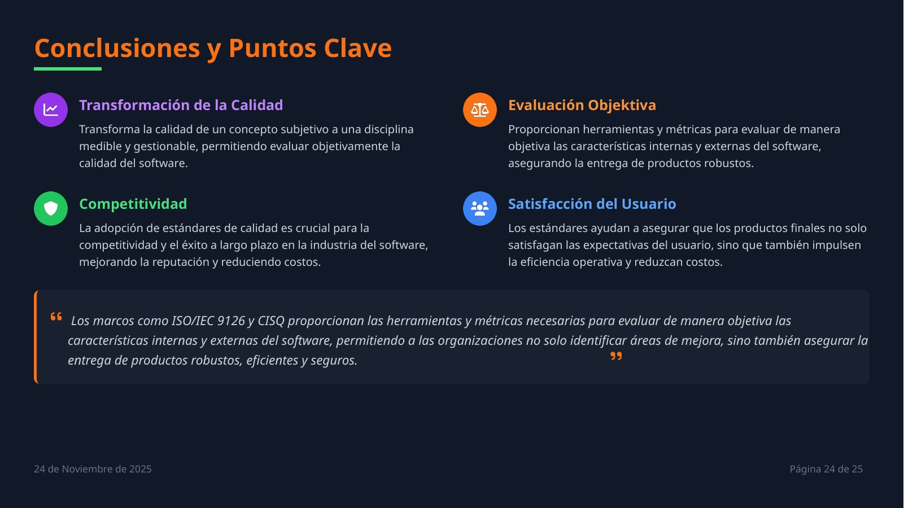

---

## Diapositiva 23

Preguntas y Cierre

¡Gracias por su atención!

Correo Electrónico

dlgamboa1@espe.edu.ec

Teléfono

0984210393

24 de Noviembre de 2025

Página 25 de 25

