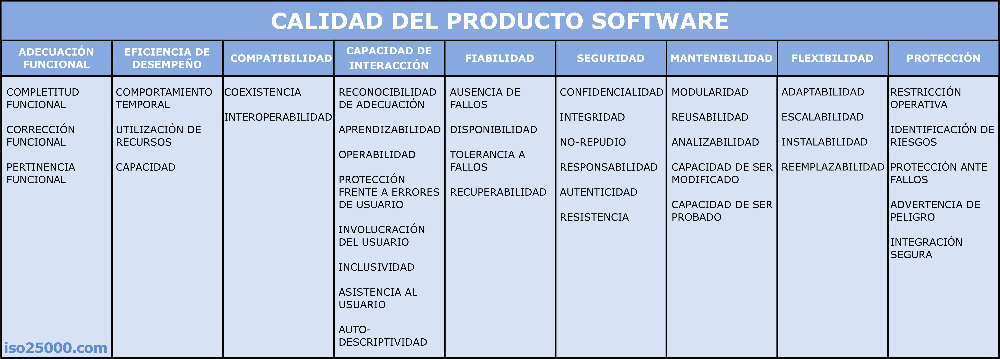

# ISO/IEC 25010 - Portal ISO 25000

- **Archivo de origen:** `Link`
- **URL reconstruida:** `https://iso25000.com/index.php/normas-iso-25000/iso-25010`
- **Contenido consultado:** página 1 y página 2 del portal ISO 25000.

## Idea central

El modelo de calidad es la base para evaluar la calidad del producto software. Permite determinar qué características y subcaracterísticas se deben considerar al evaluar un producto.

La calidad del producto software se interpreta como el grado en que el producto satisface los requisitos de sus usuarios y aporta valor. Estos requisitos pueden incluir funcionalidad, rendimiento, seguridad, mantenibilidad, entre otros.

## Modelo de calidad del producto software ISO/IEC 25010

El portal presenta nueve características principales:

| Característica | Subcaracterísticas |
|---|---|
| Adecuación funcional | Completitud funcional, corrección funcional, pertinencia funcional |
| Eficiencia de desempeño | Comportamiento temporal, utilización de recursos, capacidad |
| Compatibilidad | Coexistencia, interoperabilidad |
| Capacidad de interacción | Reconocibilidad de la adecuación, aprendizabilidad, operabilidad, protección frente a errores de usuario, involucración del usuario, inclusividad, asistencia al usuario, auto-descriptividad |
| Fiabilidad | Ausencia de fallos, disponibilidad, tolerancia a fallos, recuperabilidad |
| Seguridad | Confidencialidad, integridad, no repudio, responsabilidad, autenticidad, resistencia |
| Mantenibilidad | Modularidad, reusabilidad, analizabilidad, capacidad de ser modificado, capacidad de ser probado |
| Flexibilidad | Adaptabilidad, escalabilidad, instalabilidad, reemplazabilidad |
| Protección | Restricción operativa, identificación de riesgos, protección ante fallos, advertencia de peligro, integración segura |

## Descripción resumida por característica

### Adecuación funcional

Capacidad del producto software para proporcionar funciones que satisfacen necesidades declaradas e implícitas de los usuarios bajo condiciones especificadas.

### Eficiencia de desempeño

Evalúa el desempeño del producto al realizar sus funciones dentro de parámetros de tiempo, rendimiento y uso eficiente de recursos como CPU, memoria, almacenamiento, energía y comunicaciones.

### Compatibilidad

Capacidad del producto para intercambiar información con otros productos o funcionar adecuadamente cuando comparte entorno y recursos.

### Capacidad de interacción

Capacidad del producto para permitir que el usuario interactúe con su interfaz e intercambie información para completar tareas.

### Fiabilidad

Capacidad del sistema o componente para desempeñar funciones especificadas, bajo condiciones y periodo de tiempo determinados, sin interrupciones o fallos.

### Seguridad

Capacidad para proteger información y datos, de modo que personas u otros productos tengan el acceso adecuado según autorización, y para resistir ataques malintencionados.

### Mantenibilidad

Capacidad del producto para ser modificado de forma efectiva y eficiente por necesidades evolutivas, correctivas o perfectivas.

### Flexibilidad

Capacidad del producto para adaptarse a cambios en requisitos, contextos de uso o entorno del sistema.

### Protección

Capacidad del producto, bajo condiciones definidas, para evitar estados que pongan en peligro la vida humana, la salud, la propiedad o el medio ambiente.
